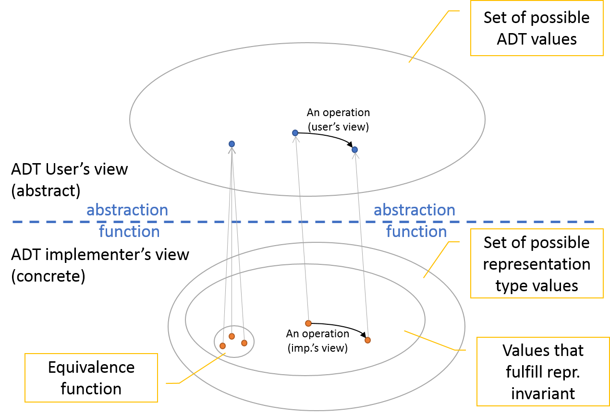

% C1-ADTs
% (manuel.freire@fdi.ucm.es)
% 2025.01.21

## Goal

> Abstract Data Types\
>   Goals and implementation

# Motivation

### Statement

For any integer number $x$, we add the square of its digits and obtain a new number $x_1$. 
We carry out the same operation and obtain $x_2$, and so on until one of these two things happens:

- we obtain $1$ as a result, and we say the number is `happy`
- we never get a $1$ (because we enter a cycle that does not include a $1$), and we say the number is `unhappy`

## Example
- 7 is happy: $7 \rightarrow 49 \rightarrow  97 \rightarrow  130 \rightarrow  10 \rightarrow  1$
- 38 is unhappy: $38 \rightarrow  73 \rightarrow  \textbf{58} \rightarrow  89 \rightarrow  145 \rightarrow  42 \rightarrow  20 \rightarrow  4 \rightarrow  16 \rightarrow  37 \rightarrow \textbf{58} \rightarrow \ldots$

- - - 

This will repeat a **lot** of work. And what should I initialize **`life`** to?

~~~{.cpp}
bool isHappy(int n, int life) {
    if (n == 1) return true;
    if (life == 0) return false;

    int sum = 0;
    for (/**/; n > 0; n/=10) {
        int d = n%10;
        sum += d*d;
    }
    return isHappy(sum, --life);
}
~~~

- - - 

This does not duplicate work. And there is no pesky **`life`** to track!

~~~{.cpp}
bool isHappy2(int n, std::set<int> &known) {
    if (n == 1) return true;
    if (known.find(n) != known.end()) return false;
    known.insert(n);

    int sum = 0;
    for (/**/; n > 0; n/=10) {
        int d = n%10;
        sum += d*d;
    }
    return isHappy2(sum, known);
}
~~~

# Abstraction

To concentrate on the important part of the problem, we hide unnecessary details try to design a more abstract solution.

- To read a configuration file, we do not worry about the file system or the physical device where the data are stored. System libraries and the OS deal with those details, while allowing the programmer to use the `file` abstraction, an entity that allows us to read and write data. A file is an example of **abstract data type (ADT)**.

There are two main types of abstraction:
 
 - **functional**: hides the details of an **operation**. It is the one we have been using up to now. Separates *specification* (what it does) vs *implementation* (how it is done). For example, when using `sort(v, n)`, elements will get sorted $O(n \log n)$, and it *just works*!

 - **data**: separates the way in which we can use a data type and the way in which it is internally coded. If the functional abstraction is a way to add **operations** to a programming language, the data abstraction is a way to add **data types** to it.

# Predefined ADTs

Some ADTs are **predefined** in programming languages, that is, are internally coded and we can use them without knowing their representation: 

- int, long
- char
- float, double
- bool
- arrays ...
    
In general, ADTs work the way the programmer expects them to do\footnote{principle of least astonishment (POLA)}, but sometimes details are important (e.g. overflows).

A classical predefined ADT in C++ is the *character string* (`std::string`). For any string `s`, we can 
    
- know its length using `s.length()` or `s.size()`
- concatenate it via `s += t`
- copy it using `t = s`
- print it to a stream with `std::cout << s`
- ...

# User ADTs

Structs in C / C++ allow us to define new data types, but they do not allow to hide their details to the user. Object oriented languages such as C or Java have classes, which **can** hide implementation details.

~~~{.cpp}
struct Date {
  int day;
  int month;
  int year; 
  Date(int d, int m, int y):day(d),month(m),year(y){}
};
~~~

Now we can write `Date f = Date(14, 7, 1789)` or `Date f(14, 7, 1789)`, and access its fields using `f.day` or `f.month`: we have defined a new type. 

However, we can create inconsistent dates: `f.month = 13` or `f.month = 2; f.day = 30`.

And it does not have operations to add or subtract days to a given date, or to calculate the day of the week of a given date. Each programmer will have to implement all these operations, and two different implementations are likely to be incompatible with each other.

# A better Date

\footnotesize
~~~{.cpp}
class Date {
public: // accessible from outside
  // Ctor: day, month & year
  Date(int day, int month, int year); 
  // Alt Ctor: offset from a base date by passed-in days
  Date(const Date &base, int days);   
  // distance, in days, between this and other (Obs.)
  int distance(const Date &other) const;
  // day-of-month (Obs.)
  int day() const;  
  // day-of-week (Obs.)
  int dayOfWeek() const;  
  // month (Obs.)
  int month() const;
  // year (Obs.)
  int year() const;
private: // NOT accesible from outside
  int _day;		// between 1 and 28,29,30,31, depending on month & year
  int _month;	// between 1 and 12
  int _year;
};

Date::Date(int day, int month, int year) {
    _day = day; _month = month; _year = year;
}
int Date::day() const { return _day; }
int main() { 
    Date f(14, 7, 1789);
    std::cout << "for f(14, 7, 1789), f.day() = " << f.day() << "\n";
    return 0; 
}
~~~
\normalsize

# Operations

A good ADT specification must include its basic \emph{operations}.

These operations can use other data types: for example, a \emph{Chessboard} data type may use the types \emph{Piece} and \emph{Position} in its \emph{move} operation.

The previous example shows a more complete \emph{Date} data type where the domain of the implementation is specified, along with a set of operations.

- observers for day, dayOfWeek, month and year
- a distance operation
- constructors, both full and offset

Have a look at real examples\footnote{Dates are *hard*. Be prepared to learn a lot about humans and time-keeping...} to see how dates are handled!

- [java JodaTime](https://www.joda.org/joda-time/apidocs/index.html)
- [java 11](https://docs.oracle.com/en/java/javase/11/docs/api/java.base/java/time/LocalDate.html)

# Public vs Private

The **public part** includes the operations that can be used externally, and it is independent from the private part (from the user's point of view).

Public operations are a **contract** between the programer of the ADT and its users. As long as the programmer only modifies the private part and the users only use the pubic part, things will continue to work.

Each programming language may offer certain features to separate the private and public parts of the implementation:

- \textbf{privacy}: all the implementation details are completely hidden and unaccessible to the user. This is the case of the Java \emph{Interface}. It is possible to simulate it in C++, but it is not part of the language, strictly speaking.
- \textbf{protection}: trying to access the private parts of the ADT causes compilation errors. Both C++ and Java have this kind of control, using the reserved words \emph{public:} or \emph{private:} within the ADTs.
- \textbf{convention}: if there is no other mechanism, then the user and the implementer may agree in not to use or modify whatever is marked as private. A typical mark is to use **`_`** as the first character of an identifier, such as `_day`. It is not necessary in C++ (although it is useful), but it was in C.

# Better privates

With the current version of the private part it is easy to implement \emph{day()} or \emph{months()}, but it will be more complicated to implement \emph{distance()}, \emph{dayOfWeek()} and \emph{dayOfYear()}. 

- We could have chosen an implementation that stored \emph{\_dayOfYear} and \emph{\_year}. This would ease the calculation of \emph{distance()} between dates of the same year or \emph{dayOfYear()}, but it would make more difficult to implement \emph{day()} or \emph{month()}. 
-  In any case, the ADT user would not be able to see the difference, since the public part would be the same.
- In general, every ADT has design decisions that must take into account the ways in which the ADT is going to be used.

# Designing and using ADTs

Like the functional abstraction, type abstraction is useful for code \emph{reuse}: a single ADT can be used multiple times. In addition, it is easier to reuse code that makes use of ADTs: it is more compact and legible than the equivalent code that doen not use ADTs.

- better top-down design: starting from the highest level of abstraction, we refine concepts and types until we reach the lowest implementation level.
- better bottom-up design: starting from the simplest abstractions and building up the more complex ones on top of them.

- - - 

## Example of top-down design

in order to code a chess game, we start defining a \emph{Chessboard} and its basic operations: create moves, play moves, check the state of the game, load/save the board, \ldots As we do it, we define what a \emph{Move} is, a \emph{Position} and a \emph{Piece}. 

This allows us to decide what is important, but it does not allow us to test the code early.

- - - 

## Example of bottom-up design

in order to code a chess game, we define a \emph{Position} and a \emph{Move}. We add several types of \emph{Piece}, each of which has several moves. Everything takes place in a \emph{Chessboard}. 

This allows us to test the code early, but it fails in choosing the operations to implement, since it takes some time to gain a broad view of the system.

# ADTs and modules

Most programming languages include the concept of \emph{module} - a set of related data and operations that can be seen as a unit and which are accessed through a well defined interface. The concept of module includes ADTs, so in general ADTs should be implemented as modules.

In C++, this involves the \emph{declaration} of a class in a .h header file (e.g. \emph{date.h}), and its \emph{implementation} in an associated .cpp file (e.g. \emph{date.cpp}):

~~~{.cpp}
// required includes to compile this .h
#include <system_library>
#include "own_module.h"

// protects against multiple-inclusion
#ifndef _DATE_H_
#define _DATE_H_

// ... declaration of Date goes here ...

// end of multiple-inclusion protection
#endif
~~~

Yes, it is 2025 and we still do this. Yes, C++ is, language-wise, quite dated.

# ADTs and data structures

An ADT = data plus operations on those data

- A \textbf{data structure} is a strategy to store and manage data in memory. Many ADTs can be implemented using data structures. For example, the ADTs \emph{stack} and \emph{queue} can be implemented using the same data structure: \emph{linked list}.  
- Some ADTs are so frequent that we can expect most languages to have an implementation for them. The standard libraries of C++, Java or C-Sharp include implementations of search trees or hash tables.
- Some structures are only used in specific domains, such as \emph{quadtree}, which are quite common in GIS (\emph{Geographical Information Systems}) because they allow to find the closest point to a given one in $O(logn)$.
\end{itemize}

# Implementing ADTs

- In this section we analyze how to code ADTs in C++, which is a very flexible and powerful language\footnote{but also crufty and dangerous. We should really be teaching *rust*}. In general, there is more than one way to do something, and the disadvantages of certain implementations may not be clear.
- The contents of this section include \emph{best practices} used both in academia and industry, so you can use it as a reference for your own implementations.

# Types of operations and the const modifier

Operations can be classified as \emph{generators}, \emph{modifiers} or \emph{observers}.

- **Generator**: Creates a new object of a given type. Using generator operations it is possible to create all the possible values of the type.
- **Modifier**: Same as the generators, but they do not belong to the \emph{minimum set} of operations that allow us to create the values of the type.
- **Observer**: They allow us to read the data of the main type, coded as other types - but they  \emph{do not modify} the observed type (therefore, their declaration includes the \emph{const} modifier). For example, \emph{toString}, \emph{dayOfMonth} in \emph{Date} as an integer, \ldots

# Types of operations that we will be using

Adapted to OO languages, we will be using:

- **Constructor**
  creates a new object. In C++ a constructor has the same name as the class of the object it creates. They are automatically invoked when an instance of the class is declared. They can be omitted if there is nothing to initialize.
- **Mutator**
  modifies an object. In C++ they cannot\footnote{It is \emph{possible} to cast const away. Never do that without a \emph{really} good excuse!} be accompanied by the \emph{const} modifier.
- **Observer**
  does **not** modify the object. In C++ they *should* be accompanied by the \emph{const} modifier.
- **Destructor**
  destroys an object, releasing the resources that were created by the constructor. Destructors are automatically invoked when the scope of the object ends. They can be omitted if there is nothing to release.

# The goodness of constness

The \textbf{const} modifier must be used whenever it is possible, as it provides several advantages. For example, an object without mutators can be shared without running the risk of having the object modified by third parties.

-  When designing an ADT, an operation can be provided either as a mutator or as an observer.
For example, in \emph{Date}, we can provide the add operation either as \emph{add(int days)}, which modifies the current date adding \emph{delta} days (mutator), or we can make it return a new date that is \emph{delta} days in the future (observer and, therefore, \emph{const}).

There is often a **tradeoff** between *safe* (const, new objects) and *cheap* (not-const, no new allocations)

# Using sub-ADTs and extending ADTs

It is frequent to see an ADT using another one. A good example for using an internal ADT would be using a \emph{Point} ADT inside a \emph{Rectangle}

~~~{.cpp}
#include "Point.h" // uses Point
/*
 * A 2D axis-aligned rectangle
 */
class Rect {
private:
    // ...
public:
    // constructor
    //    origin is lower-left
    Rect(Point origin, float width, float height);

    // constructor
    //    points are opposite corners
    Rect(Point one, Point another);
~~~

- - -

~~~{.cpp}
    // returns points with lower x, y coords (Obs.)
    const Point &origin() const;
    float width() const;
    float height() const;
    
    // equality (Obs.)
    //   empty rects are all considered equal
    bool equal(const Rect &r) const;
 
    // total area (Obs.)
    float area() const;

    // true if area is 0 (Obs.)
    bool isEmpty() const;       
    
    // true if Point inside (or on-border) and rect not-empty (Obs.)
    bool inside(const Point &p) const;
    
    // true if all points in r are in this rect (Obs.)
    bool inside(const Rect &r) const;

    // intersection: smallest rect that is inside both (Obs.)
    Rect intersection(const Rect &r) const;
~~~

# Enriching ADTs 

- It is also common to \emph{enrich} data types: use a data type in order to add operations and or extend its domain. 
- In languages that support object orientation, the use of inheritance allows us to do it in a compact, explicit way. 
- In general, we will *not* use inheritance in this course -- but it exists and we can use it in C++.

Note: in general, you should prefer composition to inheritance. Look up "Liskov-substitution" for problems with willy-nilly inheritance\footnote{A Square should not be a subclass of Rectangle, because in a Square height = width is part of the invariant, and in the Rectangle this is not so. What should happen to the height if I change the width of a Square?. Subclasses should not break if treated like superclasses!}.

# Generic ADTs

A *generic* ADT is one in which one or more of types is not explicitly identified, so that the *same* structures and operations can be used with *different* types. 

> \
> in a `Set` ADT, there should not much of a difference \
> between storing elements of type `int`, `Point`, or `std::string`.

There are different ways to achieve generic types:

- **templates**: used in C++; template types are determined at compilation time in order to generate all the concrete variations that are used. They are strongly typed.

- **inheritance** / **interface**: available in all OO languages. Types must either *inherit from a common base type* that implements all basic operations, or implement an *interface* with those operations.

- **dynamic languages**: JavaScript or Python allow data types to acquire or change their operations during run-time. The objects only need to accept the new operations at run-time ("Duck-typing")- this makes compile-time error checks innefective.

Note: there *are* other options, like type-erasing generics (Java), pointers + offsets + function-pointers (C), or traits (Rust). The three above are pretty popular, though.

# Type templates in C++

In C++, we can define generic ADTs using the following sintax:

~~~{.cpp}
template <class A, class B>
class Pair {
    // a generic pair
    A _a; B _b;
public:
    // Simple constructor
    Pair(A a, B b) : _a(a), _b(b) {} // implementation in the .h (!)
    
    // Observers
    A first() const { return _a; }
    B second() const { return _b; }
};
~~~

and then refer to the types in the same way we do with other types. In general, we use *capital letters* that refer to their use; for example, for a generic \underline{t}ype we use \emph{T}, for an \underline{e}lement \emph{E}; etc.

- - - 

~~~{.cpp}
#include <iostream>
#include <string>
#include "pair.h"
using namespace std;
int main() {
    Pair<int,string> p(5, "hello");
    Pair<float,int> q(5, 6.0f);
    cout << p.first() << " " << q.second() << "\n";
    return 0;
}
~~~

# Generic types and .h files

Generic implementations *must* go **in the .h file**, because they *must* be present for each context where the template is to be instantiated:

~~~{.cpp}
template <class A, class B>
class Pair {
    // a generic pair
    A _a; B _b;
public:
    // Simple constructor
    Pair(A a, B b);
    // Observaers
    A first() const;
    B second() const;
};
// if outside the class, must repeat whole generic type declaration
template <class A, class B>
Pair<A,B>::Pair(A a, B b) { _a = a; _b = b; }
template <class A, class B>
A Pair<A,B>::first() const { return _a; }
template <class A, class B>
B Pair<A,B>::second() const { return _b; }
~~~

# Implementation, partiality and errors

It is important to make a distinction between an ADT and a specific \textbf{implementation} of that ADT.

- ADTs are, by definition, abstractions. When we choose a specific implementation, we include limitations that may be different if we chose a different implementation.
- For example, the typical implementations for `int` use 32 bits (but there are others with 64, and some others that are only limited by the amount of available memory, but which are much slower: see Python numbers). 
- Whatever is true for the ADT is also true for its implementations. However, the limitations of one implementation of that ADT need not affect other implementations of the same ADT.

# Representing types, equivalence function, and invariants

When designing the *private* part, we choose

- the \emph{representing types}: specific types used to represent the ADT. For example, a 32-bit int for dates
- an \emph{abstraction function}: how we interpret those types as an ADT type. For example, as seconds since 1970-1-1 at 0:00
- an \emph{equivalence function}: conditions that must be met for 2 values to be considerd the same. 
- \emph{representation invariants}: conditions that must always hold for that type. 

And then we implement operations to ensure that the representation invariants are always met (with possibly additional restrictions due to the chosen representing type).

- - -

One option for dates:

- representing types: 3 32-bit ints for `d`, `m`, `y`
- abstraction function: `d` is day-of-month, `m` is month-of-year, `y` is year
- equivalence function: all fields must be equal for two dates to be equal
- representation invariant: all must be positive, traditional rules for max days-in-month, months between 1 and 12 both included

Another option for dates:

- representing types: 1 32-bit counter `c` for days-since-1st Jan 1970
- abstraction function: substract whole years (taking into account leap years) to get years; do the same for months, finally get days 
- equivalence function: same counter means same date
- representation invariant: `c` must be positive

- - - 

`Rectangle`

- \emph{Point} as its origin and two \emph{int} for the height and width (= \emph{representing types}). All the empty rectangles are equivalent, irrespective of the origin (since they do not contain any point); this interpretation provides us with the \emph{abstraction function} and the \emph{equivalence function}; the height and the width must be, for non-empty rectangles, strictly greater than 0 (\emph{representation invariant}).

- two \emph{Point}s in opposite vertices, being equal in the case of an empty rectangle. We can decide that the  $x$ and $y$ coordinates of the second point must always be greater than the ones of the first point, which would provide an additional invariant (and simplify many operations).  

- - -

`Complex`

- a pair of \emph{float}, one for the real part and another for the imaginary part. The equivalence and abstraction functions are trivial, and the representation invariant is always met.

- two \emph{double}s, using a polar representation (angle-module). The abstraction function is the interpretation of (angle-module)  (and the rule to transform this representation into \emph{(real, imaginary)}), and the representation invariant could be used to restrict the range of possible angles to the interval $[0, 2\pi]$.

# Restrictions imposed by implementations

- **Y2K**: Many systems developed during the 70s and the 80s represented years using two characters `XX`, interpreting them as `19XX`. This caused many problems in year 2000, that was regarded as 1900 by these systems.
- **Y38K**: Similarly, an integer value represented as a 32 bit \emph{int} can only represent $2^{32}$ different values - which restricts the implementation domain of any ADT that uses 32 bit \emph{int}s as representing types. If we represent a \emph{Date} as an \emph{int} for the number of seconds since January 1, 1970, it will be impossible to use dates later than January 19, 2038.

And, more mundane,

- a 4-byte **int** is limited to $2^{32}$ different values; and will typically wrap around when overflowed.
- a 4-byte **float** cannot represent $1/3$ exactly, and operations on floats can generally lose precision. Using `float` or `double`, adding many floating-point numbers that are sorted can give *different results if you go from smallest to largest (best) than if you add them up the other way*!

# Plato's Cavern

# Partiality

Because there are restrictions due to implementation (and on ADT operations themselves), some operations will simply not work on certain ADT states:

- numerical overflow due to not-enough-bits to represent a result
- out-of-memory when adding elements to a container
- ...

Those operations should be marked as **partial**, so that users can either avoid triggering the bad result, or detect them. Some operations *always* lead to errors (not implementation-derived, but due to violating ADT operation preconditions), such as:

- trying to access elements beyond the size of a container
- trying to access elements in an empty container
- dividing by zero.

They, too, are considered *partial*. So, for practical purposes, if it *can* error out with any conceivable ADT state and/or parameters, an operation is *partial*

# Errors

So, how do we notify users that an **error** (due to *partiality*) has occured? There are several options:

- Return an **error value**. For example, in `indexOf(E element)`, you could return an invalid index, `-1`. But:

    + you need to have a **clearly invalid** value to return as an error! What if you were implementing `add(int x, int y)`?
    + the user needs to **remember to check** that value. Example: `mySet.remove(value)` in Java returns a boolean if removal failed. Would you remember to check it? Should you?

- Set an **error flag**, which is some kind of global variable (eg.: `errno`) that must be checked to see if there was an error or not. This avoids the "must be able to return a clearly invalid value" problem, but is *very* easy to ignore.

- Throw an **exception**. 

    + requires language support (which is there in C++, Java, JS, and most modern languages)
    + requires the user to choose either to catch the exception or to let it bubble up the stack

- **Complain** via on-screen message. Only ok for very early debugging of small programs.
- Require an additional **error handling function** to be passed in as argument. Found in JS when handling asynchronous requests.

# Exceptions in C++

~~~{.cpp}
#include <iostream>
int divide(int a, int b) {
    if (b==0) {
        throw "division by zero";       // type 'const char *'
    }
    return a/b;
}

using namespace std;
int main() {
    try {
        cout << divide(12,3) << "\n";
        cout << divide(1, 0) << "\n";   // throws exception
        cout << "hello world!" << "\n"; // never called!
    } catch (const char * &s) {         // ref. to thrown type
        cout << "ERROR: " << s << "\n";
    }
    return 0;
}
~~~

# Exception types

Exceptions may have any type. However, it is better to use **specific classes**:

- easier to use consistently (was it \fbox{division by zero}? \fbox{cannot divide by zero}? \fbox{illegal operand}?)
- can provide more information about the error

~~~{.cpp}
#include <iostream>
#include <string>
#include <climits>

class Exception {
  const std::string _cause;
public:
  Exception(std::string cause) : _cause(cause) {};
  const std::string &cause() const { return _cause; };
};
class DivZero : public Exception {
  public: DivZero(std::string cause):Exception(cause){};
};
class Overflow : public Exception {
  public: Overflow(std::string cause):Exception(cause){};
};
~~~

- - -

~~~{.cpp}
int add(int a, int b) {
    if ((a>0 && b>0 && a>INT_MAX-b) || 
        (a<0 && b<0 && a<INT_MIN-b)) {
        throw Overflow("sum limits exceeded");
    }
    return a+b;
}

int divide(int a, int b) {
    if (b==0) {
        throw DivZero("in division");
    }
    return a/b;
}
~~~

- - -

\footnotesize
~~~{.cpp}
using namespace std;
int main() {
    try {
        cout << divide(12,3) << "\n";
        cout << add(INT_MAX, -10) << "\n";
        cout << divide(1, 0) << "\n";        // throws exception
        cout << add(INT_MAX,  10) << "\n";   // never evaluated
    } catch (DivZero &dc) {                  // handles DivZero (if needed)
        cout << "Division by zero: " << dc.cause() << "\n";
    } catch (Overflow &db) {                 // handles Overflow (if needed)
        cout << "Overflow: " << db.cause() << "\n";
    } catch (...) {                          // handles any other exception
        cout << "Another exception!\n";
    }
    return 0;
}
~~~
\normalsize

- - - 

Or, much cheaper, and recommended for simple programs:

~~~{.cpp}
class DivZero {};
class Overflow {};
~~~

# Exceptions in C++ vs Java

* Java exceptions must be `Throwable`. This base exception class has a 
    - optional cause (another exception that caused *this* exception to be thrown)
    - stack-trace
    - some text describing the error

* Java has two families of exceptions: 

    - run-time exceptions, such as `OutOfMemoryException` or `IllegalArgumentException`
    - checked exceptions, such as `IOException`. If you *can* throw one of those, you *must* say so in the function header. You cannot just silently let them bubble upwards.

C++ exceptions are of the `run-time` type, and can be of any type, so you cannot (without writing a dedicated exception class), rely on all the "free" machinery that Java exceptions have. 

- - - 

In C++ 11, you do have a [`noexcept`](https://en.cppreference.com/w/cpp/language/noexcept_spec) modifier, which is handy to indicate that you *cannot* throw. You can also query the compiler to know if something can conceivably throw:

~~~{.cpp}
void no_throw() noexcept;

// ... much later
if (noexcept(no_throw()) {
    // always reached: noexcept(no_throw()) evaluates to true
    //  no need to have no_throw be noexept 
    //  (as long as it cannot conceivably throw) if in C++ 17+
}
~~~

We will not be using this, but it is good to know it exists.

# Const and references

~~~{.cpp}
  // returns the vertex that is closest to the point p
  const Point &Polygon::contains(const Point &p) const;
~~~

- The 1st and 2nd \emph{const}: the point passed as an argument and the point returned as a result are non-modifiable references. 
- The last const: this is an observer function, so that the polygon upon which it is used is not modified.

# Return values

- Mutator functions should generally return **void**

- Observers that return only *one* value, should:

    - **return** small values (`bool`, `int`, pointers...) directly (= by value)\
      `int size() const { return _size; }`
    
    - return big values ...    

        + by **value** when no other copy exists, or when you *need* a copy:\
          `Map copy() const { return Map(*this); }`
        + by **constant reference** when another copy exists, and doing so avoids creating new copies:\
          `const Point& origin const { return _origin; }`

- *Multiple* values can be returned either\footnote{For an in-depth answer, see https://stackoverflow.com/a/52842140/15472} ...

    - using reference or pointer **arguments** (ugly\footnote{We further adopt the rule that you \emph{cannot} use an argument both as input and output})
    - using a *struct* or *class*

- - - 

~~~{.cpp}
// with references, use _result suffix to make it abundantly clear 
//  that this is an output param
void Rect::dimensions(int &size_result, int &width_result) const;
// with pointers, users will have to call with &: 
//  somewhat clearer than references
void Rect::dimensions(int *size_result, int *width_result) const;
// with a struct
const Dimension &Rect::dimensions() const;
~~~

# Dynamic and static implementations

Some ADTs may need variable amounts of space, and we cannot know the amount until run-time.

- the size of a *set* or *vector* may vary between no elements and millions 
- instead of reserving a fixed size, it is better to ask for memory only when we know it will be needed.

Memory obtained at run-time taps into the computer's full memory, shared between all processes, and is typically in the order of **several GBs**

- called **dynamic** memory, and comes from the **heap**
- must be **manually requested and freed** with a *lot* of care

Compile-time memory is small and per-process (**10s of MBs**, depends on OS)

- called **static**, and comes from the **stack**, which is also used for recursion
- is **managed automatically**

# Pointers, new & delete

In C++, dynamic memory is 

- managed using *pointers*, which are just memory addresses
- allocated and freed using the operators 

    + **`new`** and **`delete`** (for single values)
    + **`new[]`** and **`delete[]`** (for arrays)
    
~~~{.cpp}
  const int MANY = 1<<30;        // = 1024 * 1024 * 1024
  struct Big { char stuff[MANY]; };

  char *dynamic = new char[MANY]; // 1GB dynamic memory
  Big b = new Big();              // also 1 GB dynamic memory

  // ... use memory ...

  delete[] dynamic;            // free dynamic array
  delete b;                    // do not confuse delete and delete[] !
~~~

# Pointers: how did they work?

~~~{.cpp}
  int x = 10, y[] = {3, 8, 7};
  Pair<int, int> *pair = new Pair<int, int>(4, 2);

  int *px = &x;           // &x: memory address of x
  int z = *px;            // *px: data pointed to by px, == 10
  int x = pair->first();  // == (*pair).first(), == 4
  int *py = y;            // an array is a ptr to its first pos
  int w = *(py+1);        // == py[1], == y[1], == 8
~~~

# Sizeof

The C++ compiler can tell you how much space a value takes using \
**sizeof** (in bytes) 

~~~{.cpp}
const int MANY = 1<<10;

int anInt;
struct Big { char stuff[MANY]; } aStruct;
char *dynamic = new char[MANY];
char inStack[MANY];
char *aPointer = inStack+1;

cout << sizeof(anInt) << endl; 
cout << sizeof(aStruct) << endl;
cout << sizeof(dynamic) << endl; 
cout << sizeof(inStack) << endl; 
cout << sizeof(aPointer) << endl;       
~~~

- - - 

**Beware**, `sizeof` *ignores everything* regarding dynamic memory & **pointers**

~~~{.cpp}
const int MANY = 1<<10;

int anInt;
struct Big { char stuff[MANY]; } aStruct;
char *dynamic = new char[MANY];
char inStack[MANY];
char *aPointer = inStack+1;

cout << sizeof(anInt) << endl;    // 4
cout << sizeof(aStruct) << endl;  // MANY
cout << sizeof(dynamic) << endl;  // 8! - pointer (to heap)
cout << sizeof(inStack) << endl;  // MANY
cout << sizeof(aPointer) << endl; // 8! - pointer (to stack)
~~~

# Pointers beware!

- Accessing an **un-allocated** pointer, or accessing an offset of that pointer that is **beyond the allocated size**. Will generally contain rubbish, and probably cause the program to crash. Attempting to de-reference `NULL` (=0) in particular should always crash the program.

- Forgetting to **free a pointer** after use. Causes a *memory leak*. Over time, if the system runs out of memory,

    + new memory allocations will fail
    + the OS will start trying to kill processes to avoid crashing

- Attempting to **free a pointer more than once**. Undefined behaviour. May crash the program.

- Attempting to **use previously free'd memory**. Undefined behaviour. 

    + may no longer be accessible (and attempting access would cause the program to crash)
    + may still be accessible and contain rubbish
    + may still contain what it contained before

- Attempting to **acces an old pointer**, from a previous execution. Will generally behave as an *un-allocated pointer*: every time you run your program, the OS will give you different return values for memory allocations. This is partly due to security concerns (look up *ASLR*).

# Memory under the hood

- Modern operating systems use *virtual memory*: 

    + pointer addresses do not correspond to actual physical memory addresses
    + in particular, *virtual* memory can exceed *physical* memory via *paging*

- Each process is granted access to regions of *virtual* memory

    + regions have starting address, end address, and permissions
    + access with wrong permissions, or outside accessible regions, results in a *segmentation fault*
    + segmentation faults result in the OS killing your program (SIGSEGV)

- Shared access to regions is possible, but only by request. The default is private, exclusive access.

On Linux, given a process with PID *1234*, you can look at its memory map at `/proc/1234/maps`

- - - 

\scriptsize
~~~{.txt}
55dc597db000-55dc597dc000 r--p 00000000 08:11 11029268  /home/mfreire/Dropbox/teach/ed/src/hello
55dc597dc000-55dc597dd000 r-xp 00001000 08:11 11029268  /home/mfreire/Dropbox/teach/ed/src/hello
55dc597dd000-55dc597de000 r--p 00002000 08:11 11029268  /home/mfreire/Dropbox/teach/ed/src/hello
55dc597de000-55dc597df000 r--p 00002000 08:11 11029268  /home/mfreire/Dropbox/teach/ed/src/hello
55dc597df000-55dc597e0000 rw-p 00003000 08:11 11029268  /home/mfreire/Dropbox/teach/ed/src/hello
55dc5b7d2000-55dc5b7f3000 rw-p 00000000 00:00 0         [heap]
7f2ff359d000-7f2ff35a1000 rw-p 00000000 00:00 0 
7f2ff35a1000-7f2ff35ae000 r--p 00000000 08:11 25698376  /usr/lib/x86_64-linux-gnu/libm-2.31.so
... (more libm & libc)
7f2ff38dc000-7f2ff38de000 rw-p 001eb000 08:11 25698372  /usr/lib/x86_64-linux-gnu/libc-2.31.so
7f2ff38de000-7f2ff38e2000 rw-p 00000000 00:00 0 
7f2ff38e2000-7f2ff38e5000 r--p 00000000 08:11 25705819  /usr/lib/x86_64-linux-gnu/libgcc_s.so.1
... (more libgcc & libstdc++)
7f2ff3ad9000-7f2ff3adc000 rw-p 001db000 08:11 25706489  /usr/lib/x86_64-linux-gnu/libstdc++.so.6.0.28
7f2ff3adc000-7f2ff3ae1000 rw-p 00000000 00:00 0 
7f2ff3b07000-7f2ff3b08000 r--p 00000000 08:11 25698358  /usr/lib/x86_64-linux-gnu/ld-2.31.so
... (more ld)
7f2ff3b36000-7f2ff3b37000 rw-p 00000000 00:00 0 
7fff762d5000-7fff762f7000 rw-p 00000000 00:00 0         [stack]
7fff76380000-7fff76383000 r--p 00000000 00:00 0         [vvar]
7fff76383000-7fff76384000 r-xp 00000000 00:00 0         [vdso]
ffffffffff600000-ffffffffff601000 --xp 00000000 00:00 0 [vsyscall]
~~~
\normalsize

Output of `cat /proc/742076/maps` on teacher's computer running a simple "hello world" C++ program that waits for input:

- 40 memory regions, including program, heap, stack, and runtime libraries. All are marked `p` for *private*
- only 2 regions marked `x` for *executable*: our program (`hello`), and `vdso`\footnote{see https://lwn.net/Articles/615809/ for a deep dive into vdso}
- on this system, the stack starts with only 132KB - but can grow to up to 8MB if needed. The total program footprint is 1.5 MB.

# Avoiding errors with dynamic memory
 
- Use dynamic memory **only when necessary**.

    + dynamic memory is only *better* if it prevents you from running out of stack memory. Otherwise, *avoid it*. It is *not* "more elegant".

- Initialize pointers right when you declare them (**RAII**\footnote{Resource Allocation/Aquisition Is Initialization}). 

    + if this is impossible, at least assign `nullptr`\footnote{\emph{nullptr} is C++11 for \emph{NULL}, and has certain advantages. Use it in new code.}, so that attempts to use the pointer will produce an error.

- After freeing a pointer, assign it the `nullptr` value

    + \textbf{delete()} never frees `nullptr` (or `NULL`, or `0`) pointers, so we can avoid multiple attempts to release the same memory address.

~~~{.cpp}

Set *c = new Set(); // assigns value in the same declaration    
delete c;    // delete checks nullptr before freeing
c = nullptr; // set to nullptr after delete to avoid multiple frees
~~~

- Use memory debugging tools, such as Valgrind

# Constructors and Destructors

In any \emph{dynamic implementation} of an ADT \footnote{ADTs are neither static nor dynamic; \emph{only their implementations} are)}, there are two important pieces of code: the creation of a new instance of the ADT (where, as part of the initializations, \emph{new}s are called) , and the release of resources once we finish working with a given instance of a class (where the necessary \emph{delete}s are called): the **constructor** and **destructor**.

- They do not have a return type: errors can only be reported via exceptions
- Their names are associated to the name of the ADT. For a ADT `X`, they will be `X` and `~X`, respectively
- If unspecified, the compiler generates default versions, public, without arguments, and with empty implementations

- - -

Example constructors and destructors for a `Map` class:

~~~{.cpp}
  class Map {
      unsigned short *_cells; // 2 bytes per cell
      int _width;
      int _height;
  public:
      // Generator - Constructor
      Map(int width, int height) : _width(width), 
                                   _height(height) {
          if(width<1||height<1) throw "bad dimensions";
          _cells = new unsigned short[_height*_width];
          for(int i=0;i<height*width;i++) _cells[i]=0;
          std::cout << "built: map of  "
                    << _width << "x" << _height << "\n";
      }
~~~

- - - 

~~~{.cpp}     
      // Generator - Mutator
      void cell(int i, int j, unsigned short v) {
          _cells[i*_width + j] = v;
      }
      
      // Observer
      unsigned short cell(int i, int j) {
          return _cells[i*_width + j];
      }
      // Destructor
      ~Map() {
          delete[] _cells;
          std::cout << "destroying: map of "
                    << _width << "x" << _height << "\n";
      }    
  };
~~~

- - - 

~~~{.cpp}  
  int main() {
      Map *m0 = new Map(128, 128); // constructor (m0)
      Map m1 = Map(2560, 1400);    // constructor (m1)
      {   // new block
          Map m2(320, 200);        // constructor (m2)
      }   // destructor (m2)
      delete m0;                   // destroy m0
      m0 = nullptr;

      return 0;
  }  
  // destroy m1; m0 is a pointer, and requires explicit delete
~~~

- - - 

- Static variables (\emph{m1} and \emph{m2}) are freed automatically when the blocks in which they are declared finish
- Dynamic variables (\emph{m0}) must be freed explicitly. 

    + If \emph{m0} had not been freed via explicit `delete`, there would have been a memory leak. 
    + Calling **delete** on a pointer of a type \
      *invokes its corresponding **type destructor***
    + Calling **delete[]** on a pointer of an array of a type \
      *invokes type **destructors on all its items***

- Output of previous example:
~~~{.txt}
    built: map of 128x128
    built: map of 2560x1400
    built: map of 320x200
    destroying: map of 320x200
    destroying: map of 128x128
    destroying: map of 2560x1400
~~~

# Copy operator, copy constructor, move operator

There are actually a few more default operations:

- the **copy operator** allows copying of a user value using the `=` operator
- the **copy constructor** allows initializing a value directly, without needing to first create a dummy value, and then using the copy operator.
- the **move operator & constructor** do the same, but avoid generating copies. 

~~~{.cpp}
MyClass();                                    // Default constructor 
~MyClass();                                   // Destructor

MyClass(const MyClass& other);                // Copy constructor
// from here onwards, only generated if using default destructor
MyClass& operator=(const MyClass& other);     // Copy assignment op. 	
// from here onwards, only since C++11
MyClass(MyClass&& other) noexcept;            // Move constructor
MyClass& operator=(MyClass&& other) noexcept; // Move assignment op. 
~~~

If a (non-default) **destructor** is present, then the compiler will **NOT** generate:

- any assignment operators
- any move constructor

But it **will** generate a default **copy constructor**, and it will probably be **wrong**

# Rule of 3

If you have a dynamic implementation of an ADT and you define **any** of these, **you probably need all 3**: 

- a **destructor**, because there is some resource to explicitly clean up
- a **good copy constructor**, because the default one will copy pointer values, but not what they point to
- a **copy assignment operator**, generally by calling the (good) copy constructor

The *rule of 5* adds the move constructor & move assignment operator; but those are simply *good to have*, as opposed to *outright necessary*, because no move-defaults are generated.

# Failing to follow the Rule of 3

~~~{.cpp}
// Map is dynamic and has a custom destructor, but 
//   is using defaults for copy const. & copy ass. op.
Map m1(100, 100);
Map m2(10, 10); 
m2 = m1;        // default copy assignment op.
Map m3 = m1;    // default copy const.; same as writing m3(m1)
// now, all 3 maps point to the exact same data!
//   modifying any _cells in m2 will also change _m1 and _m2
//   destructors attempt to *delete* the same pointer 3 times
// also, we have *leaked* m2's memory and can no longer recover it
~~~

Output when running:

~~~{.txt}
built: Map of 100x100
built: Map of 10x10
destroying: Map of 100x100
double free or corruption (!prev)
Aborted (core dumped)
~~~

# Dynamic or static implementations?

Static implementations

- are easier to write and read, because they \
    do not need to allocate and free memory
- default operators (all 6 of them) work as expected\
     as long as no pointers are used
- are faster than dynamic implementations, because memory management requires system calls that may take time\footnote{when performance is important, dynamic implementations often choose to make few big allocations instead of many small ones; this minimizes system calls}

Dynamic implementations

- avoid wasting memory, because they can allocate only what they need
- can potentially use much more memory: \
    stack space: ~8 MB max; heaps can be several GBs)
- can potentially share memory, if you are really careful to avoid nasty side-effects

# Exercises

-  Implement the \texttt{Complex} ADT that represents complex numbers in C++. Use \texttt{float} for the real and imaginary parts of the numbers and add operations for adding, subtracting, multiplying and calculating the module of the number, along with observer methods that return the real and imaginary parts of the number.
	
-  Code a generic version (using C++ \emph{templates}) of the \textit{Complex} ADT. Test it with `double` and `float`

- - - 

-  Code the following operations of a \texttt{Set} ADT, and calculate their cost:

    *  \texttt{isEmpty}, determines whether the set is empty
    *  \texttt{unitary}, creates a set with a given element
    *  \texttt{cardinal}, returns the number of elements of the set
    *  \texttt{union}, \texttt{intersection} and \texttt{subtraction}, which perform the corresponding operation between two sets
	* an \texttt{==} operator to compare two sets
	
- - - 

-  Code the \texttt{Polynomial} ADT using natural coefficients that represents a polynomial of degree g = $\sum_{i=0}^g c_i*x^i$ using and array $P[0..N]$ with $N\geq g$ so that $P[i]=c_i$ for each $i$, $0\leq i \leq g$.

-  Code the operations of the \texttt{Date} ADT, using the representation invariant that takes an \textit{int} to count the number of seconds since January 1, 1970.

-  Code the \texttt{Rectangle} ADT that uses the \texttt{Point} ADT inside, with the operations seen in class. Use \textit{float} for the coordinates and the dimensions.

- - - 

-  Implement a \texttt{Vector} ADT to represent a dynamic vector of integers. The constructor must receive the initial size of the vector. There is an operation, \texttt{get(i)} to read the element in position $i$, an operation \texttt{dimension()} that returns the current size of the vector and an operation \texttt{set(i, value)} to change the value of element $i$. The operations must throw exceptions when the value of $i$ is out of the vector. The operation \texttt{setDimension(d)} changes the size of the array to size \emph{d} (either bigger or smaller than the current size). In both cases, all the elements that fit in the vector must be kept in the same position. Be careful with the destructor and the default copy operator.

-  Modify the \texttt{Vector} ADT to accept any type of element.

-  Modify the implementation of the \texttt{Set} ADT to use the \texttt{Vector} ADT instead of an array. Initially, use a \texttt{Vector} of size \textit{INI} and resize it to size \texttt{setDimension(dimension() + INI)} when necessary.

-  Modify the implementation of the \texttt{Set} ADT to use the \texttt{vector} provided in the STL.

-  Modify the implementation of the \texttt{Polynomial} ADT to use the \texttt{vector} provided in the STL.

# Questions? Comments?

{ width=25% }

This work is licensed under a [Creative Commons Attribution-ShareAlike 4.0 International License](https://creativecommons.org/licenses/by-sa/4.0/)

- Initial version by Manuel Freire (2012-13)
- Initial English version by Gonzalo Méndez (around 2017?)
- Changes for academic year 2022-23 by Manuel Freire
