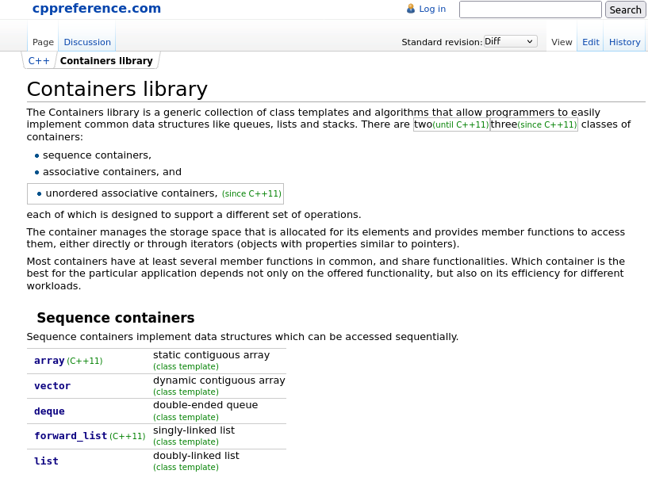
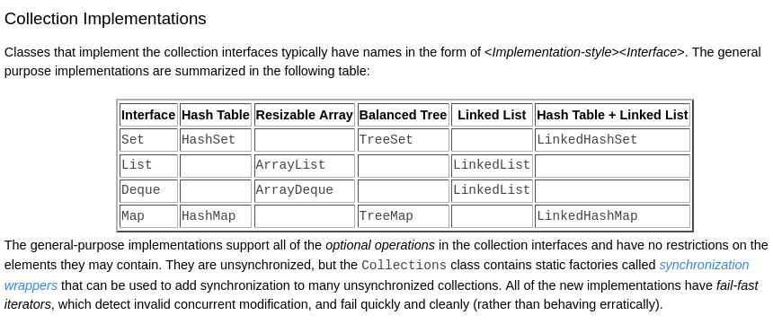
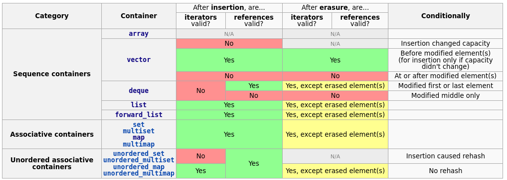
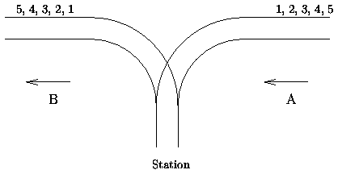

% C2-Linear ADTs
% (manuel.freire@fdi.ucm.es)
% 2023.02.04

## Goal

> Linear data types

# Motivation

## Statement

Agent 0069 has invented a new method of coding secret messages, where
the original message $X$ is encoded in two stages:
1. $X$ is transformed into $X'$ replacing each succession of consecutive non-vowel characters with their mirror image.
2. $X'$ is transformed into the sequence of characters $X''$ by taking characters from the ends of $X'$ (alternating between first and last) until all characters of $X'$ are in $X''$

## Example

~~~{.txt}
Bond, James Bond // X
BoJ, dnameB sodn // X'
BnodJo s, dBneam // X''
~~~

## Direct implementation

~~~{.cpp}
string encode(string input) {
  string step1;
  int n = input.length();
  int i = 0;

  // Step 1: Mirror non-vowel sequences
  while (i < n) {
    if (is_vowel(input[i])) {
      step1 += input[i++];
    } else {
      int start = i;
      while (i < n && !is_vowel(input[i])) {
        i++;
      }
      for (int j = i - 1; j >= start; j--) {
        step1 += input[j];
      }
    }
  }
  // ...
~~~

- - - 

~~~{.cpp}
  // ...

  // Step 2: Create X'' by taking characters from the ends
  string step2;
  int left = 0;
  int right = step1.length() - 1;
  while (left <= right) {
    if (left == right) {
      step2 += step1[left++];
    } else {
      step2 += step1[left++];
      step2 += step1[right--];
    }
  }

  return step2;
}
~~~

- - - 

~~~{.cpp}
string encode2(string input) {
  // Step 1: Mirror non-vowel sequences  
  auto ss = input.end();  // start of current non-vowel sequence
  for (auto p=input.begin(); p!=input.end(); p++) {
    if (is_vowel(*p) && ss != input.end()) {
      reverse(ss, p);     // reverse the non-vowel sequence
      ss = input.end();
    } else if (!is_vowel(*p) && ss == input.end()) {
      ss = p;
    }
  }
  if (ss != input.end()) {
    reverse(ss, input.end());
  }
  // Step 2: take characters from the ends
  auto start = input.begin();
  auto end = input.rbegin(); // reverse iterator, advances backward
  string output;
  while (output.size() < input.size()) { 
    output += output.size()%2 ? *end++ : *start++;  
  }
  return output;
}
~~~

# Consecutive vs Scattered

## Two big families of linear data structures

Linear means "forming a line". But you can make two very different types of lines: either with **consecutive** items in memory (vector, circular vector) or **scattered** items, joined only through pointers (linked lists). Each has advantages and disadvantages:

### consecutive

- most space-efficient: no pointers wasting space!
- faster: no pointers to follow, and cache-friendly to boot
- problems when growing (OS cannot give you "more memory in the same place"); instead, you need to "move to a bigger house"
- problems filling in gaps

### scattered

- less space-efficient: pointers take up space
- slower: following pointers takes up time, cache misses
- no problems growing or shrinking: link more or less!
- no problems filling gaps

## A typical vector

~~~{.cpp}
template <typename T>
class AVector {
  T *data;      // dynamic memory here
  int size;     // number of used elements in data
  int capacity; // actual size of data; if more needed, grow
  // ... public part 
};
~~~

Vectors do not allow efficient insertion except at the very end, and removing elements anywhere except the end requires fixing the gap in O($n$).

Growing requires allocating more (typically 2x previous capacity) memory, and copying all old elements from the old to the new memory, before releasing the old memory to the OS.

## A circular vector

~~~{.cpp}
template <typename T>
class ACircularVector {
    T*  data;  // dynamically-reserved array of elements
    int start; // index of first used slot
    int end;   // index of first free slot after start
    int capacity; // total number of slots in data

    int pos(int i) const { return (i + start) % capacity; }
    // ... public part
};
~~~

This variation of a normal vector allows efficient insertion & removal from *both* ends -- at the cost of some math to keep track of `start` and `end`.

They still have to grow if you insert over their capacity, though. And most never shrink (just like typical vectors).

## A doubly-linked list

~~~{.cpp}
template <typename T>
class AList {
  struct ANode {
    ANode *next; // link to next element, nullptr if none
    ANode *prev; // link to prev element, nullptr if none
    T value;
  } *first, *last;  // to 1st and last nodes, nullptr if empty
  int size;      // to keep track of total nodes
  // ... public part 
};
~~~

Note that, in a 64-bit architecture, you pay 16 bytes in pointers for each `T` payload, per node.

And every time you add a node, you have to allocate it from the OS. On the other hand, you can very easily add & remove elements, and never grow or shrink.

## A singly-linked list

~~~{.cpp}
template <typename T>
class AList {
  struct ANode {
    ANode *next; // link to next element, nullptr if none
    T value;
  } *first, *last;  // to 1st and last nodes, nullptr if empty
  int size;      // to keep track of total nodes
  // ... public part 
};
~~~

A singly-linked list has half the pointers (you pay 8 bytes per node instead of 16) - but does not support removing elements from the end efficiently.

## Complexity & overhead in linear ADTs

  ADT     first      middle      last    size:adt size:per-element
--------- ---------- ----------- ------- -------- -------------
slist     1 1 1      n n n       1 1 n   8-20     8
dlist     1 1 1      n n n       1 1 1   16-20    16
vector    1 n n      1 n n       1 1 1   12       0+
cvector   1 1 1      1 n n       1 1 1   16-24    0+

For each ADT, the table reflects 

- *big-Oh* amortized cost of **access**, **insertion** and **deletion** at different positions in the sequence, with *middle* being a one-shot access somewhere between first and last. 

- the size overhead in bytes per-ADT and per-element on a typical 64-bit architecture (8 bytes per pointer, 4 bytes per int).

Note that consecutive ADTs have 0 overhead (no pointers), but typically have unused capacity (to allow grow-free inserts). Growing them takes a full O(n), but is infrequent enough to retain "amortized O(1)".

# Iterators I: foreshadowing

## Indices & pointers as iterators

Intuition:

- In an array, you can **access** the *i-th* value as `a[i]`. Given `i`, the **next** element is at `i+1`.

- Alternatively, you can use a pointer to the start of the array `p`. Then, you can **access** its value as `*p` and go to the **next** element via `p++`

- In a linked list, you need to get to that position first (via a pointer), and then you can **access** it with `n->value`. The **next** value is at `n->next`:

~~~{.cpp}
T valueAt(int i) {
  ANode *n = first;
  while (i-->0) { n = n->next; } // advances i times
  return n->value;
}
// (note lack of error mgmt, for simplicity's sake)
~~~

## Iterators

An **iterator** is an abstraction of *a position in a sequence*, supporting operations to **access** the current value (optionally: modify it too) and **advance** to the next element. To be useful, you also need to **create** iterators to the beginning (or to any valid position, or to a position with a certain value) and **compare** your iterator to one-past-the-end, to avoid running out of elements:

\newcommand*\ra{\rightarrow}

ADT       privates       it.at()      it.next()  it.begin()     it.end() 
--------- -------------- ------------ ---------- -------------  -------- 
list      ANode *p       p$\ra$value  p$\ra$next list$\ra$first nullptr  
vector(1) T *v, int idx  v[idx]       idx++      {v,0}          {v,v.size()}
vector(2) T *p           *p           p++        &(v[0])        &(v[v.size()])

C++ frequently uses operator overloading for iterators:

- `it.at()` becomes `*it`

- `it.next()` becomes `it++`

## Why use iterators?

Iterators add abstraction. Abstraction is good for reuse:

- Algorithms that work with iterators *do not care* about what collections they are run on... as long as those iterators work as advertised. See `<algorithm>`

~~~{.cpp}
  // end & start: iterators at opposite ends of input
  //              advancing towards each other via ++
  while (output.size() < input.size()) { 
    output += output.size()%2 ? *end++ : *start++;  
  }
~~~

- Pointers are ugly and dangerous, and iterators hide them. This allows you to use pointer-based ADTs safely. 

## Variations on iterators

Besides plain iterators, there are lots of additional types:

- **Const** iterators: read-only, nice to provide read-only access

- **Reverse** iterators: start at last element, move towards first.

- List iterators (for doubly-linked lists): 

  * **bidirectional**: support *both* `next()` and `prev()`
  * allow you to **erase** elements in O(1) (return new iterator which you must use from then on, 'cause yours is now broken)
  * allow you to **insert** elements in O(1), either right after or right before iterator.

- Iterators on non-sequences. For example, on a tree, you could define a *depth-first* iterator, or a *breadth-first* iterator, and so on.

- *Generators*: "iterators" that make up their "next" whenever it is called. Think python's `xrange` ...

## Dangers of iterators

Iterators are great, but they are *fragile*. In particular, they can become disconnected from whatever they were pointing to (**invalidated**), and then accessing them becomes **U**ndefined **B**ehavior. This also happens to pointers.

- In a vector, iterators become invalid if the vector **grows** (because the memory changes location), or when *anything before them* is added or removed (because they no longer point to what they used to).

  + If your vector auto-shrinks (rare), this would also invalidate any iterators. C++'s vector explicitly avoids it for this reason.

- In a list, iterators become invalid if the node they pointed to dissapears (**erase** operation.)

Documentation always covers this in extensive detail, because **UB** is really bad.

# Consecutive sequential ADTs in detail

## Vector and you

* Found in all major languages
  - C++ `<vector>`
  - Java `ArrayList`
  - JavaScript `[]`, sort-of
  - Python lists (`[]`)

* Best value for money in 90% of applications
  - Simple. Efficient. Feels like an array.
  - Very cache-friendly

* Bad when big & you try to add or remove stuff in middle
  - Quite rare: in most cases, worth it instead of using linked lists
  - Also, in these cases a `set` or `map` may work better than either `vector` or `list`

## "Official" vector

~~~{.cpp}
template <class T>
class Stack {
    // ... public stuff

    /** Pointer to data. */
    T * _data;
    /** Capacity of array (as reserved via new[]). */
    unsigned int _max;
    /** Actual number of stored elements. */
    unsigned int _size;
};
~~~

Our official list of ADTs does not include a real vector-like ADT, but this code is from **Stack.h**. It is only missing random-access to become quite similar to C++'s **std::vector**:

- `T &at(int i) { return _data[i]; }` 

- `T &operator { return at(i); }`

## Growing your vector (Stack.h)

~~~{.cpp}
void push(const T &_elem) {
    _data[_size] = _elem;
    _size++;
    if (_size == _max) {
        grow(); // full, must grow
    }
}

void grow() {
    T *old = _data;
    _max *= 2;
    _data = new T[_max];
    for (unsigned int i = 0; i < _size; ++i) {
        _data[i] = old[i];
    }
    delete []old;
}
~~~

## How can **push** be O(1)?

The **grow** operation is O(n), and is called whenever we run out of space!. But...

- Imagine a vector with $n$ (large) elements. Assume that it has only grown since the very beginning (only push, no pops). How many times has the vector grown? How many times has each element been copied around?. 

  * The last $n/2$ elements have *never* been copied or moved. 
  * The next $n/4$ got copied *once* or more.
  * The next $n/8$ got copied *twice* or more.
  ...
  * The very first elements have been copied at each and every growth.

- For $n$ elements, there have been at most $log_{2}(n)$ growths, each double the size of the previous one. What is the total number of copies?

  * If the copies grow as $O(n)$, then, for n inserts, \
    **each insert is still amortized** $O(1)$
  * And that is exactly what happens: $n/2 + n/4 + n/8 + \dots = n$

## Constructor, destructor & copy (Stack.h)

~~~{.cpp}
void init() { // called from Stack()
    _data = new T[INITIAL_CAPACITY];
    _max = INITIAL_CAPACITY;
    _size = 0;
}

void free() { // called from ~Stack() & Assignment operator
    delete []_data;
    _data = nullptr;
}

void copy(const Stack &other) { // called from Copy Ctor
    _max = other._size + INITIAL_CAPACITY;
    _size = other._size;
    _data = new T[_max];
    for (unsigned int i = 0; i < _size; ++i) {
        _data[i] = other._data[i];
    }
}
~~~

## Writing less code for your Ctor, Dtor, Copy & Assignment (Stack.h)

~~~{.cpp}
Stack() { 
  init(); 
}

~Stack() { 
  free(); 
}

Stack(const Stack<T> &other) { 
  copy(other); 
}

Stack<T> &operator=(const Stack<T> &other) {
  if (this != &other) {  // defensive; avoids s = s explosions
      free();
      copy(other);
  }
  return *this;
}
~~~

## Deep equality (Stack.h)

~~~{.cpp}
bool operator==(const Stack<T> &rhs) const {
    if (_size != rhs._size) {
        return false;
    }
    bool same = true;
    for (unsigned int i = 0; i < _size && same; ++i) {
        if (_data[i] != rhs._data[i]) {
            same = false;
        }
    }
    return same;
}
~~~

Shallow equality would simply test to see whether `_data == rhs._data`... which is O(1), but not that useful.

Note that `_max` is (correctly) ignored - only the values before `_size` should be compared.

# Scattered sequential ADTs in detail

## Singly-linked vs Doubly-linked lists

* Singly linked lists...

  - only have `next` pointers
  - are more space-efficient: one less 8-byte pointer (on 64-bit architectures)
  - are good enough for stacks & queues

* Doubly linked lists...

  - have both `prev` and `next` pointers in each node
  - take an extra 8 bytes for the `prev` pointer
  - and are a lot more flexible as a result

    + can implement efficient dequeues
    + can use bidirectional iterators

## List customization

You can make your list ADT cooler (and bigger) by ...

* including a `size` attribute. Pay 4 bytes, keep track of size and provide `int size() const` in $O(1)$ instead of $O(n)$.
* including a `last` attribute. Pay 8 bytes, allow direct access to last element in $O(1)$, `push_back()` in $O(1)$, and if doubly-linked, `pop_back()` in $O(1)$.

On the other hand, a minimal list is just a pointer to the an element (or, if double, to 1st and last). You can avoid the ADT altogether!

## Real minimal lists: intruders in the kernel!

~~~{.c}
// in your kernel code (hacker you!)
struct clown_car {
        int tyre_pressure[4];
        struct list_head clowns; // <-- an intrusive list!
};
// in the linux kernel headers; empty if points to itself
struct list_head {
        struct list_head *next, *prev;
};
#define container_of(ptr, type, member) ({                      \
        const typeof( ((type *)0)->member ) *__mptr = (ptr);    \
        (type *)( (char *)__mptr - offsetof(type,member) );})

#define list_entry(ptr, type, member) \
        container_of(ptr, type, member)

// ... list_{add_tail,add_head,del,empty,for_each_entry,...}
~~~

See [https://docs.kernel.org/core-api/list.html](https://docs.kernel.org/core-api/list.html) to learn more!

## Why have intrusive lists?

The linux kernel is mostly C (certainly *not* C++, some recent rust, even some assembly...)

- intrusive lists are cool!

  + have the *same* list code work regardless of container node type
  + mix container nodes types in the same list!
  + make anything a list-node!

- C has no templates, and the kernel dos not want C++

  + kernel people hate C++. This has not changed much in the last 20 years (but C++ has)
  + read Linus Torvalds ranting on [C++ in the kernel](https://lore.kernel.org/lkml/Pine.LNX.4.58.0401192241080.2311@home.osdl.org/) and [C++ for Git](https://web.archive.org/web/20160428102707/http://thread.gmane.org/gmane.comp.version-control.git/57643/focus=57918)

## A full list: List.h

~~~{.cpp}
template <class T>
class List {
    class Node {
      public:
        // ... ctors ...
        T _elem;
        Node *_next;
        Node *_prev;
    };
    
    // ... public stuff ...

    // ... const & non-const iterators ...

    Node *_first;
    Node *_last;
    unsigned int _size;
};
~~~

## A simpler list: Queue.h

~~~{.cpp}
template <class T>
class Queue {
    class Node {
      public:
        // ... ctors ...
        T _elem;
        Node *_next;
    };

    // ... public stuff ...

    Node *_first;
    Node *_last;
    int _size;
};
~~~

## Overview of lists in Official ADTs

ADT                Type        Supported ops
------------------ ----------- ----------------------------
LinkedListStack.h  single      push, pop, top, empty, size
List.h             double      all + const and non-const iterators
ListSingle.h       single (ph) \textit{\{push,pop\}\_\{front,back\}}, front, back, empty, size
Queue.h            single      push_back, pop_front, front, empty, size

A phantom node (ph above) is an initial node that never contains any value. It reduces the number of nullptr checks (first & last always point to *something*), at the expense of 1 unused node.

~~~{.cpp}
// without phantom
const T &front() const {
  if (_first == nullptr) {
    throw EmptyListException("Cannot get front. The list is empty.");
  }
  return _first->_elem;
}
// with phantom
const T & front() const {
  assert (_head->_next != nullptr); // empty, explode!
  return _head->_next->_value;
}
~~~

# Operations on list ends

## General observations

- **push_front** & **push_back** add elements to the start and end of the list, respectively.

- **pop_front** & **pop_back** remove elements from the start and end of the list. Note that **pop_back** is generally not available for singly-linked lists, because "the element before the last one" takes O(n) to find.

- If your list is used to implement a **stack**, you add (**push**) & remove (**pop**) from the same end. **LIFO**: last-in, first-out.

- If your list is used for a **queue**, you add & remove from opposite ends. **FIFO**: first-in, first-out. You call this **push_back** and **pop_front**, by analogy to a real queue.

## Pop_back in a singly-linked list (ListSingle.h)

With phantom node (hence guaranteed `head`, but empty if no `head->_next`)

~~~{.cpp}
void pop_back() {
  assert (_head->_next != nullptr);
  Node *previous = _head;
  Node *current = _head->_next;

  while (current->_next != nullptr) {  // O(n) : find _tail->"_prev"
    previous = current;
    current = current->_next;
  }

  delete current;
  previous->_next = nullptr;
  _tail = previous;
}
~~~

Possible, but avoid if you can. Similar to inserting or removing at beginning of an array.

## Inserting an element (List.h)

~~~{.cpp}

    /** 
     * Inserts e between node1 & node2. Returns ptr to new node. O(1)
     * General case: both exist.
     *   node1->_next == node2
     *   node2->_prev == node1
     * Special cases: one or both is nullptr
    */
    Node *insertElem(const T &e, Node *node1, Node *node2) {
        Node *new_node = new Node(node1, e, node2);
        if (node1 != nullptr)
            node1->_next = new_node;
        if (node2 != nullptr)
            node2->_prev = new_node;
        _size ++;
        return new_node;
    }
~~~

## Removing an element (List.h)

~~~{.cpp}
    /**
     * Removes a node. If node has neighbors, updates their pointers.
     * Does not accept nullptr.
     * O(1)
     */
    void deleteElem(Node *n) {
        assert(n != nullptr);
        Node *pprev = n->_prev;
        Node *pnext = n->_next;
        if (pprev != nullptr) {
            pprev->_next = pnext; // update previous, if any
        }
        if (pnext != nullptr) {
            pnext->_prev = pprev; // update next, if any
        }
        _size --;
        delete n;
    }
~~~

## Push & pop if you have insert & delete available (List.h)

~~~{.cpp}
void push_front(const T &_elem) {
    _first = insertElem(_elem, nullptr, _first);
    if (_last == nullptr) {
        _last = _first;    // was empty; last is also 1st element
    }
}
void push_back(const T &_elem) {
    _last = insertElem(_elem, _last, nullptr);
    if (_first == nullptr) {
        _first = _last;    // was empty; 1st is also last element
    }
}
~~~

- - -

~~~{.cpp}
void pop_front() {
    if (empty()) throw EmptyListException("Cannot pop. Empty!");
    Node *toErase = _first;
    _first = _first->_next;
    deleteElem(toErase);
    if (_first == nullptr) { // if now empty, must also update last
        _last = nullptr;
    }
}
void pop_back() {
    if (empty()) throw EmptyListException("Cannot pop. Empty!");
    Node *toErase = _last;
    _last = _last->_prev;
    deleteElem(toErase);
    if (_last == nullptr) { // if now empty, must also update first
        _first = nullptr;
    }
}
~~~

## Pop_back without auxiliary methods

~~~{.cpp}
void pop_back() {
    if (empty()) throw EmptyListException("Cannot pop. Empty!");
    Node *toErase = _last;
    _last = _last->_prev;      // <-- removed deleteElem, 11 lines 
    if (_last == nullptr) { // if now empty, must also update first
      _first = nullptr;
    } else if (_last->_prev) { // <-- added 4 lines
      _last->_prev->_next = _last;
    }
    _size --;
    delete toErase;
}
~~~

It is generally easier to write code with auxiliary methods, but there is also a price to pay (more code, slightly less efficient). In general, *it is a price very much worth paying*. 

# Pointer juggling

## What is it, why do it?

The main advantage of scattered sequential ADTs (*linked lists*) is that you only pay for what you use, and once you have it, you never need to copy elements - just fool around with the nodes!. We define **pointer juggling** as 

> do interesting things with linked lists only by modifying their links, without copying, creating or deleting elements needlessly.

* It is worth 25-30% of the final exam grade.
* It justifies using linked lists. It is one of their few advantages!
* It is good training for more complex structures. Be not afraid of pointers, young adventurer!

## Cases where juggling is justified

* Splice a list, by splitting it somewhere and adding or removing elements at that position. Surprisingly useful operation.
* Reversing a list.
* Merging lists together. MergeSort is all about this.
* Concatenating lists. When you grow an open-table HashMap (will remind you of growing vectors), each bucket is a linked list. You have to concatenate them all, and then re-build new lists in each bucket.

Yes, this is actually done (except reversing, I've never needed to do that outside class).

## How to juggle

* Visualize your goal. Ideally, draw it somewhere, with pointers as arrows.
* Draw out intermediate steps.
* Write a program that carries out those steps.
* Check for edge-cases

## How to juggle faster: the importance of detachment

* Most juggling can be made faster (programmer-time, not computer-time) by implementing 

   - a `detach` operation, which is like `deleteElem` but does not delete the pointer.
   - an `attach` operation, which is like `insertElem` but takes a (previously detached) pointer instead of creating a new one.

## Detach & attach, doubly-linked list

~~~{.cpp}
void detach(Node *n) {
  Node *pprev = n->_prev;
  Node *pnext = n->_next;
  if (pprev) pprev->_next = pnext;
  if (pnext) pnext->_prev = pprev;
  if (_first == n) _first = n->_next;
  if (_last == n) _last = n->_prev;
  _size --;
}

void attach(Node *n, Node *n1, Node *n2) {
  n->_next = n1;
  n->_prev = n2;
  if (n1) n1->_next = n;
  if (n2) n2->_prev = n;
  if ( ! _first) _first = n;
  if ( ! _last) _last = n;
  size ++;  
}
~~~

## Example use: list reversal

~~~{.cpp}
void reverse() {
  List other;
  while (_size) {
    Node *n = _first;
    detach(n);
    other.attach(n, nullptr, first);
  }
  // swap this & other, making other safe to free
  swap(_size, other._size);
  swap(_first, other._first);
  swap(_last, other._last);
}
~~~

## List reversal without detach & attach

Makes you think more, but quite faster than all those detach & attach calls. Also, only touches _first and _last once, at the very end; and never even looks at _size.

~~~{.cpp}
void reverse() {
  Node *n = _first;
  while (n) {
    swap(n->_prev, n->_next);
    n = n->_prev; // is actually next
  }
  swap(_first, _last);
}
~~~

# Iterators II: revenge of next()

## Life without iterators

Iterating a list without iterators is horribly expensive:

~~~{.cpp}
List <int> list;
for (int i=0; i<list.size(); i++) {
  cout << l.at(i) << "\n";   // at(i) is O(n); n * O(n) = quadratic!
}
~~~

- Never, ever, do that.

- Not only are iterators highly useful: not using them makes life (or at least complexity) really suck.

## Iterator power!

All examples from C++' standard `<algorithm>` library. 
Note that these examples can work with *any* source of iterators; and all C++ containers fully support and provide such iterators.

~~~{.cpp}
// the smallest element in a sequence!
min_element(v.begin(), v.end());

// parallell execution! (since C++17, uses <execution>)
sort(std::execution::par, v.begin(), v.end());

// copy stuff from one place to another if condition met!
copy_if(v.begin(), v.end(), l.begin(), is_even);

// find stuff!
find(v.begin(), v.end(), 42)

// reverse! (see Bond, James Bond example)
reverse(v.begin(), v.end())
~~~

## Implementing iterators

\footnotesize

~~~{.cpp}
class List {
    // ... other stuff ...
    class Iterator {
    public: // ERROR MGMT REMOVED TO SAVE SCREEN SPACE
      Iterator() : _current(nullptr) {}
      void next() { _current = _current->next; }
      const T &_elem() const { return _current->_elem; }
      void set(const T &_elem) const { _current->_elem = _elem; }
      bool operator==(const Iterator &other) const { _current == other._current; }
      bool operator!=(const Iterator &other) const { return !(this->operator==(other)); }
      const T& operator*() const { return _elem(); }
      T& operator*() { return _current->_elem; }
      Iterator &operator++() { next(); return *this; }
      Iterator operator++(int) { Iterator ret(*this); operator++(); return ret; }
    protected:
      friend class List; // allows full access from List
      Iterator(Node *_current) : _current(_current) {}
      Node *_current;
    };
    /** Non-const iterator, starting at 1st element. O(1) */
    Iterator begin() {
        return Iterator(_first);
    }
    /** Non-const iterator at after-last element. O(1) */
    Iterator end() const {
        return Iterator(nullptr);
    }
};
~~~

\normalsize

## Const iterators 

\footnotesize

~~~{.cpp}
class List {
    // ... other stuff ...
    class ConstIterator {
    public: // ERROR MGMT REMOVED TO SAVE SCREEN SPACE
      ConstIterator() : _current(nullptr) {}
      void next() { _current = _current->next; }
      const T &_elem() const { return _current->_elem; }
      // no set()
      bool operator==(const ConstIterator &other) const { _current == other._current; }
      bool operator!=(const ConstIterator &other) const { return !(this->operator==(other)); }
      const T& operator*() const { return _elem(); }
      // no non-const * operator
      ConstIterator &operator++() { next(); return *this; }
      ConstIterator operator++(int) { ConstIterator ret(*this); operator++(); return ret; }
    protected:
      friend class List; // allows full access from List
      ConstIterator(Node *_current) : _current(_current) {}
      Node *_current;
    };
    /** Const iterator, starting at 1st element. O(1) */
    ConstIterator cbegin() const { // now const!
        return ConstIterator(_first);
    }
    /** Const iterator at after-last element. O(1) */
    ConstIterator cend() const {
        return ConstIterator(nullptr);
    }
};
~~~

\normalsize

## Using iterators: erase

~~~{.cpp}
Iterator erase(const Iterator &it) {
    if (it._current == nullptr)
        throw InvalidAccessException("No dice!");
    if (it._current == _first) {
        // Special case: 1st element
        pop_front();
        return Iterator(_first);
    } else if (it._current == _last) {
        // Special case: last element
        pop_back();
        return Iterator(nullptr);
    } else {
        // Not a special case
        Node *_next = it._current->_next;
        deleteElem(it._current);
        return Iterator(_next);
    }
}

// in your code
auto it = l.begin();
// ... move around with iterator
it = l.erase(it); // old "it" gets invalidated
~~~

## Using iterators: insert

~~~{.cpp}
void insert(const T &_elem, const Iterator &it) {
    if (_first == it._current) {
        // Special case: insert at start
        push_front(_elem);
    } else
    if (it._current == nullptr) {
        // Special case: insert at end
        push_back(_elem);
    } else {
        // Normal case
        insertElem(_elem, it._current->_prev, it._current);
    }
}

// in your code
auto it = l.begin();
// ... move around with iterator
l.insert("foo", it);
// it not invalidated, points to same thing as before
// "foo" has now been inserted right before it
~~~

## The iterator trick

* You can remove/update stuff anywhere in a (linked) list in $O(1)$ if you kept an iterator handy. Beware invalidation.
* This comes up in ~50% of final exams, worth ~10% if applicable. It is also easier to code than alternatives that score worse.

~~~{.cpp}

  // 1. have a list
  List<track_id> playlist;

  // 2. store an iterator to an element
  playlist.push_front(my_track_id);
  List<track_id>::Iterator it = playlist.begin();

  // 3. modify list, but do not invalidate iterator
  // (list iterators only invalidated if element removed)
  
  // 4. remove/access/update original element in O(1)!
  playlist.remove(it); // O(1)
~~~

## The iterator trick I: how it looks

* Example: 
    - must keep playlist handy, order is important
    - may have to remove from anywhere at any time

~~~{.cpp}
class Mp3Player {
    struct TrackInfo {
        track_id id;
        std::string name;
        std::string artist;
        List<track_id>::Iterator track_in_playlist; // <--iterator
    };
    // ... 
    List<track_id> playlist;                        // playlist
    Map<track_id, TrackInfo> tracks_by_id;          // will see later
};

// somewhere deep in Mp3Player
playlist.remove(tracks_by_id[tid].track_in_playlist);  // O(1)
~~~

Note that `List.h` only provides an iterator to the 1st element. Consider adding elements to *front* of list to be able to get an O(1) iterator to that element. C++'s `<list>` does not have this problem.

# Recap

## What we have seen

- Linear collections, where sequences of elements can be stored

- Implementations

    * **Static array**: always same size, simple, inflexible
    * **Dynamic array**: grows by doubling (amortized O(1)), great random access, linear insert/remove except at the very end
    * **Circular array**: a dynamic array with a modulus operation; efficient insert/remove at _both_ ends at the price of some math.
    * **Linked lists**: bad memory locality, waste memory with pointers, \
    but can insert, delete & reorder by _pointer-juggling_
        + Singly-linked lists: save 1 pointer per element, harder to use
        + Doubly-linked lists: more expensive, more flexible

- Interfaces

    * **Stack**: push, pop - same end = _FIFO_
    * **Queue**: push, pop - different ends = _LIFO_
    * **Deque**: push_front, push_back, pop_front, pop_back
    * **List**: as in double-ended queue, but with access to inside nodes

## Implementations & Interfaces

For each interface, your implementation choices are limited[^1]:

* Stack: no limitations
* Queue: circular vector, singly-linked list[^2], double-linked list
* Dequeue: circular vector, doubly-linked list
* List: doubly-linked list

[^1]: especially when we want all operations to be $O(1)$

[^2]: via `push_back` + `pop_front`, because there is no efficient `pop_back` for a singly-linked list.

## What you should use in real life (C++ edition)

~~~{.cpp}

// To use std::xxx, #include <xxx>

std::vector        // dynamic array; note v[i] vs v.at(i)
std::deque         // linked list of arrays, efficient deque ops.
std::list          // doubly-linked list; no random access
std::forward_list  // singly-linked list

std::stack         // view of a container (defaults to deque)
std::queue         // view of a container (defaults to deque)

std::array         // no container goodies, no growth, but has a size
~~~

See [en.cppreference.com/w/cpp/container](https://en.cppreference.com/w/cpp/container) for full details

## Looking up C++ containers

{ width=90% }

## C++ vectors

~~~{.cpp}
std::vector<int> v;
v.push_back(42);
v.size();          // 1
v.pop_back();      // returns nothing
v.empty();         // true (because v.size() == 0)

for (auto it=c.begin(); it != c.end(); /**/) {
    if (*it % 2 == 0) {
        it = c.erase(it); // O(N) complexity! avoid with vectors!
    } else {
        ++it;
    }
}

v[10];            // undefined behavior (UB)
v.pop_back();     // undefined behavior (UB) (!!)
v.at(10);         // checks bounds, throws std::out_of_range
~~~

## C++ lists

~~~{.cpp}
// same operatinos as vector, except for v.at(i) or v[i]

std::list<int> t;
for (int i=0; i<4; i++) t.push_back(i); // 0 1 2 3
auto it = t.begin();
it++;           // after, *it == 1
it--;           // after, *it == 0
auto ri = t.rbegin(); // reverse iterator! cool!
ri++;           // after, *ri == 2
ri--;           // after, *ri == 3
~~~

## What you should use in real life (Java edition)

~~~{.java}

ArrayList        // dynamic array, is Iterable, Collection & List
LinkedList       // doubly-linked, above + efficient ListIterator
Dequeue          // nice for (de)queue-like operations

// + thread-safety via Collections.synchronizedX
// concurrent versions in java.util.concurrent

~~~

## Looking up Java collections

{ width=90% }

## Java iterators

~~~{.java}
ArrayList<Integer> al = new ArrayList<>();

// works, but nobody uses it ...
for (Iterator<Integer> it=al.iterator(); it.hasNext(); /**/) {
    int i = it.next();
}

// ... because this is a lot better (since Java 1.5)
for (int i : al) { /* ... */ }
// and this works for any Iterable<T>, which includes all arrays!!

// ListIterators are cool; but may throw UnsupporteOperationException
ListIterator<Integer> li = al.listIterator(0);
li.add(42);   // ok
li.remove();  // IllegalStateException: next or previous not called
li.set(4);    // ISE: as above
~~~

## Java iterator definition & invalidation

See [actual source](https://github.com/openjdk/jdk/blob/master/src/java.base/share/classes/java/util/Iterator.java)

~~~{.java}
interface Iterator<E> {
  boolean hasNext();
  E next();
  default void remove() { /* ... */ }
  default void forEachRemaining(Consumer<? super E> a) { /* ... */ }
}
~~~

Automagic invalidation:

~~~{.java}
ArrayList<Integer> al = new ArrayList<>();

Iterator<Integer> it = al.iterator();
al.add(42);
it.next(); // throws ConcurrentModificationException: nice!
~~~

## What we will use in future exercises

* **Stack.h** - dynamic array
* **LinkedListStack.h** - singly-linked
* **Queue.h** - singly-linked; very similar to LLStack
* **ListSingle.h** - singly-linked, phantom node, no size
* **List.h** - doubly-linked list, with iterators, quite complete

## Iterators and invalidation

* Pointers are messy. They easily become invalid, and C++ only treats `nullptr` as special.

* Iterators are a bit better, but not by much: 

    - if the container changes, they may become invalid
    - rules for invalidation change depending on language & library
    - sometimes you get helpful error messages (Java CMEs) -- but not always

* Iterators *do* allow very cool generic algorithms to be implemented

## Iterator invalidation in C++

For a lengthier version, see https://stackoverflow.com/a/54004916/15472. 

{ width=90% }

## Other cool linear stuffcan be used in place of many a `begin` - `end` pair. 4 types:

* The concept of **ranges**, as slices of a sequence. Since C++ 20, they can be used in place of many a `begin` - `end` pair. 4 types:

  - `[begin, end)`, the normal type. Replaces 2 iterators.
  - `begin + [0, size)`, to take a number of elements from somewhere
  - `[begin, predicate)`, conditionally-terminated
  - `[begin, ...)`, generator-style, called `iota` in C++ view parlance

* Ranges in *rust* allow you to borrow only parts of a sequence. C++'s compiler does not care about ownership, however, rust does great things (and avoid lots of UB) with it.

## Why this chapter was important

* Beyond this course

    - You will use (lots) of dynamic arrays & linked lists in the future, regardless of language or specific version.
    - Pointers & iterators (and iteration) are here to stay. Also, with great power comes great responsibility. Know their limits.

* In this course

    - Pointer juggling worth ~30% of final exam. 
    - Trees have pointers, too (`left` & `right`, usually)
    - Iterators & iteration in next chapters too
    - Linear containers & "the iterator trick" part of last chapter (worth ~40% of final exam)

# Questions? Comments?

## Exercises

1. Use a stack to implement a non-recursive procedure that receives a integer number $n \ge 0$ and writes its digits in order and their sum. For example, given $n = 64323$, output would be `6 + 4 + 3 + 2 + 3 = 18`

2. Code a `const` function that receives a stack and writes its elements from the bottom to the top, separated by blank spaces. 

    - Code both a recursive and an iterative version of this function. 
    - Write a third version as part of the Stack class

3. Add an operation to reverse LinkedListStack. It must run in $O(n)$.

4. Implement a function that receives a sequence of characters in a list that contains (among other symbols) parenthesis, braces and brackets and decides whether it is balanced or not. A sequence is balanced if there is the same number of opening and closing symbols, and if every time a closing symbol appears the former one was the corresponding opening symbol. `({}[{}[]])` is balanced, but `[(])` is not.

- - -

5. A sequence of characters contains the symbols `<`, `>` and `.` Code a function that receives a sequence and counts the number of _diamonds_ (`<>`) we can find after removing all the _sand_ (`.`). Take into account that there can be diamonds within diamonds. For example, in the sequence `<..<..>.><..><` there are three diamonds.

6. A sentence is a palindrome if the sequence of letters obtained when traversing it from left to right (ignoring all the other characters) equals the sequence obtained when traversing it from right to left. That happens with the sentences `Go deliver a dare, vile dog.`, or even longer, `Doc, note: I dissent. A fast never prevents a fatness. I diet on cod`, or even `In girum imus nocte et consumimur igni`. For the sake of the exercise, ignore anything that is not a letter, and treat lower and uppercase letters as equivalent. Code a linear, _iterative_ function that decides if a sentence provided as a list of characters is a palindrome. You can use auxiliary ADTs.

7. Code a function that receives a stack as an I/O parameter and a number $n$ and inverts the first $n$ values at the top of the stack. Implement another version as an internal method of the `LinkedListStack` using pointer juggling (no new or delete).

- - - 

8. An arithmetical expression written with the binary operators  $+$, $-$, $*$ and $/$  is written in _Reverse Polish Notation_ (RPN, aka postfix notation) if it is either a single operand or two expressions in RPN followed by an operator. 

    Design an iterative algorithm that caculates the result of an expression written in RPN (as a sequence of characters) using the following method: create an empty stack of numbers and traverse the expression from left to right. Every time an operand is read, it is pushed into the stack. When an operator is read, the first two elements of the stack are popped, operated and the result is pushed into the stack. When this process ends, the stack only contains the result of the operation.

    A sample arithmetical operation, together with its representation in RPN is:

    ~~~
        Infix:   (A / (B - C)) * (D + E)
        Postfix: A B C - / D E + *
    ~~~

9. Repeat the previous exercise using a queue instead of a stack. In this case, when an operator is read, the two front operands are operated and inserted at the back of the queue.

- - - 

10. The major of DehesaPila is said to have been bribed when building the train station. The result is a _y_-shaped station in which there is only one entrance track and one exit track:

    { width=30% }

    All trains arrive from $A$ and go towards $B$. Can you help to decide if a train that enters with wagons numbered as $1$, $2$, ..., $n$ can rearrange them to a given order, by detaching wagons right before entering the station, and attaching them immediately after leaving it? Note that wagons can only enter the station once - you cannot reverse them into the station once they leave.

    For example, a train with the wagons numbered as $1$, $2$, $3$, $4$ and $5$, can exit with the wagons arranged in the same order (making them go in and out one by one); and can also reverse their order (by making them all go in, and then making them all go out), but there is no way to reorder them as $5$, $4$, $1$, $2$, $3$.

    Code a function takes an integer ($n$) and a reordering of the numbers from $1$ to $n$, and outputs whether such a reordering is possible or not. NOTE: problem adapted from [UVA problem 455](http://uva.onlinejudge.org/index.php?option=onlinejudge&page=show_problem&problem=455), you can check your answers there!.

- - - 

11. Extend the previous function so that, instead of just checking feasability, the output is the list of movements that must be done in order to achieve the reordering.

12. Implement the `Queue` class using dynamic arrays so that the complexity of all the operations is $O(1)$. Use a _circular buffer_.

13. Code the `Queue` class using a linked list with a ghost node.

14. Extend the implementation of the `List` ADT adding a new operation `append` that receives another list and moves its elements to the end of the original list. Achieve $O(1)$ complexity.

15. Code the ADTs _stack_, _queue_ and _dequeue_ using, as private implementation, only one attribute: a `List`.

16. For any two numbers represented as lists of digits of unknown length, where the first element of each list is the most significant digit (i.e. left digit), code a function that returns a list with the result of adding both numbers.

- - - 

17. An evil teacher has decided to pick a student "voluteer" to demonstrate pointer juggling for the whole class. To select the (un)lucky student, the teacher arranges all students in a circle, numbers them from $1$ to $n$, and starting from number $1$, saves one out of every 2, going around the circle until only one is left. Given $n$, who will be left?

18. Code a more general function that saves $1$ out of $m$ students, instead of just $1$ out of $2$.

19. Let an integer be _lucky_ if it survives the following process: place numbers between $1$ and $n \ge 2$, both included, in a queue; and remove from the queue one number out of $m = 2$; and then one out of every $m = 3$, and so on, until there are less than $m$ elements in the queue. Write a function that receives the value of $n$ and returns a list with the resulting lucky numbers.

    (Hint: in order to _save_ numbers from the queue, you can extract them from the front and re-insert them at the back)

- - - 

20. What is the resulting text after pressing the following keys in a keyboard, and at what column will the cursor be in? `d`, `D`, `<Home>`, `<Del>`, `<RightArrow>`, `A`, `<Home>`, `E`, `<End>`.

    Code a function that receives a list of keystrokes and returns a list with the resulting text.

21. Code a function that receives an array of integers of size $N$ and a number $K$, and writes the minimum value of each subarray of size $k$ in O(n).

    For example, for the array `[1, 3, 2, 5, 8, 5]` and $k=3$, the function would output `[1, 2, 2, 5]`. This is called a "sliding-window" algorithm.

22. Write a method in `LinkedListStack` that swaps the top with the next element, without copying the elements.

23. Write a method in `LinkedListStack` that sinks the top of the stack n positions, also without copying elements.

- - - 

## Iterators

24. Code a function that receives a list and prints its elements in $O(n)$.

25. Code a function that counts the occurences of a character in a list of characters with  the following signature: `int countRepetitions(const List<char> &list, char c)`.

26. Given a list of integers, count the number of positions where the contained number equals the sum of all the preceeding numbers.

27. Code a function that receives two sorted lists of integers and returns a new sorted list with the elements of both lists.

28. Extend the _list_ ADT adding two new operations `rbegin` and `rend`, which return `ReverseIterator`s that allow you to traverse the list in reverse order (from the end to the beginning).

30. Code a function that receives a list of integers and multiplies each member by an integer $n$.

- - - 

31. Code a function that searches for an element in a `List<T>` and returns an iterator to the first occurence of the element (or to `end` if not found).
  
32. Code a variant of the previous function that takes two iterators that mark off the limits of an (open) interval where the element must be searched. Reimplement the previous function in terms of this one.
  
33. Code a similar function that removes elements instead of searching for them. It must erase all the matching elements that appear in the interval (not just the first one).
  
34. Using the previous functions, code another function that receives a list of characters and removes all the occurrences of a character $c$ in the first word (that is, before the 1st space).

## The End

{ width=25% }

This work is licensed under a [Creative Commons Attribution-ShareAlike 4.0 International License](https://creativecommons.org/licenses/by-sa/4.0/)

- Initial version by Manuel Freire (2012-13)
- Initial English version by Gonzalo Méndez (around 2017?)
- Changes for academic years 2022-26 by Manuel Freire
can be used in place of many a `begin` - `end` pair. 4 types: