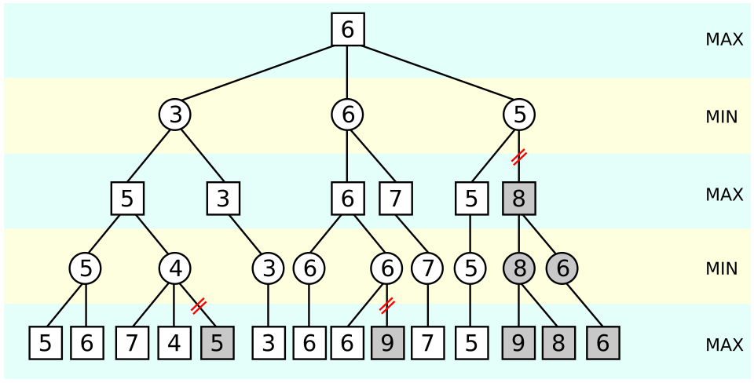

% C3-Branching ADTs
% (manuel.freire@fdi.ucm.es)
% 2026.02.25

## Goal

> Branching ADTs

# Motivation

## Statement

Given a text, output a list of the top-k most frequent words in that text.

## Example

\footnotesize

>Call me Ishmael. Some years ago—never mind how long precisely—having little or no money in my purse, and nothing particular to interest me on shore, I thought I would sail about a little and see the watery part of the world. It is a way I have of driving off the spleen and regulating the circulation. Whenever I find myself growing grim about the mouth; whenever it is a damp, drizzly November in my soul; whenever I find myself involuntarily pausing before coffin warehouses, and bringing up the rear of every funeral I meet; and especially whenever my hypos get such an upper hand of me, that it requires a strong moral principle to prevent me from deliberately stepping into the street, and methodically knocking people’s hats off—then, I account it high time to get to sea as soon as I can. This is my substitute for pistol and ball. With a philosophical flourish Cato throws himself upon his sword; I quietly take to the ship. There is nothing surprising in this. If they but knew it, almost all men in their degree, some time or other, cherish very nearly the same feelings towards the ocean with me.

(Start of Moby Dick, by Herman Melville)
\normalsize

~~~{.txt}
top-5:
  the = 10
  i = 9
  and = 7
  me = 5
  to = 5
~~~

## Direct implementation

~~~{.cpp}
// auxilary ADT to store a word & count
struct WordCount {
  string word;
  int count;
  // allows search by word with std::find
  bool operator==(const string& w) const {
    return word == w;
  }
  // allows top-k sort with std::sort
  bool operator<(const WordCount& other) const {
    return count > other.count;
  }
};
~~~

- - - 

~~~{.cpp}
struct WordCounter1 {
  vector<WordCount> counts;

  void add(const string& word) {
    // O(n) lookup, with n = size of 'counts' vector
    // could be O(log n) if counts sorted by word & bsearch...
    auto it = find(counts.begin(), counts.end(), word);
    if (it != counts.end()) {
      it->count++;
    } else {
      // O(1); but if we keep counts sorted, this would be O(n)
      counts.push_back({word, 1});
    }
  }

  void printTop(size_t k) {
    std::sort(counts.begin(), counts.end());
    for (size_t i=0; i<k && i<counts.size(); i++) {
       cout << "  " << counts[i].word 
            << " = " << counts[i].count << endl;
    }
  }
};
~~~

## A much better alternative

~~~{.cpp}
struct WordCounter2 {
  map<string, int> counts; // a red-black tree

  void add(const string& word) {
    counts[word]++; // O(1) lookup & insert !!
  }

  void printTop(size_t k) {
    vector<WordCount> cs; // re-sort by count
    for (const auto& kv : counts) {
      cs.push_back({kv.first, kv.second});
    }
    std::sort(cs.begin(), cs.end()); 
    for (size_t i=0; i<k && i<cs.size(); i++) {
      cout << "  " << cs[i].word 
           << " = " << cs[i].count << endl;
    }
  }
};
~~~

# Trees

## Intuition behind the C++ map

- The **vector** (consecutive-storage linear ADT) is great for some things, but is bad when inserts in the middle are required: $O(n)$. However, a **list** (scattered-storage linear) allows $O(1)$ insert or remove once you have a pointer to the target.
- A **sorted vector** allows $O(n log(n))$ search, but requires $O(n)$ for insert or remove operations. A **binary sorted tree** is very similar to a list, including $O(1)$ insert & delete once you find the node...

## What if we use a sorted list?

~~~{.cpp}
struct ListNode {
  string word;
  int count;
  ListNode *next;
  ListNode *prev;
};
~~~

... but we would need to always start in the middle to get $O(log(n))$ binary search. Now, call the middle a "root", rename the pointers, and ...

~~~{.cpp}
struct TreeNode {
  string word;   // more generally, a "key"
  int count;     // more generally, a "value"
  TreeNode *left;
  TreeNode *right;
};
~~~

## Tree notation & terminology

* The whole tree hangs from a single node: the **root**
* Nodes *without* children are called **leaves**
  - Nodes *with* children are **internal**
* Pointers to nodes can be called **branches**
* A tree node's pointed-to nodes are called its **children**.
  - A nodes' children, and their children, and so on are its **descendants**.
* The **parent** of a node is the one that points to it.
  - A nodes' parent, and the parents of that parent, and so on are its **ancestors**.
  - When several nodes share a parent, they are **siblings** (or **brothers**, or **sisters** - you get the idea)
* For any node in a tree, there is a single **path** from the root to that node. 
  - The length of that path is the **depth** or **level** of the node
  - The root is depth either 0 or 1, depending on who you ask.

## More notation

* Any node of a tree is, itself, a **subtree** (the root is a special case)
* The **degree** or **arity** of a node is its number of children
  - many trees have a maximum degree of 2: those are **binary** trees
  - but trees can also be general, accepting any number of children. See for example a filesystem tree.
* Trees can be **ordered** (if order of children is relevant) or **unordered**. 

In a balanced, ordered, sorted tree, you get $O(log (n))$ search time

~~~{.cpp}
struct TreeNode {
  // ...

  // O(n log n) sorted tree lookup: binary search!
  TreeNode *find(T v) const {
    if (value == v) return this;
    return (value < v) ?
      (left == nullptr ? nullptr : left.find(v)) :
      (right== nullptr ? nullptr : right.find(v));
  }
};
~~~

## A generic tree

~~~{.cpp}
template <typename T>
struct TreeNode {
  vector <TreeNode *> children;
  T value;
};
~~~

You could use this to implement 

- A **filesystem**, with T either a file (no children, but can have bytes in the file) or a folder (can have children, but no bytes)
- An **html document**, with T a DOM element + its content
- A **mathematical expression**, with T the operator & children as operands.
- An **abstract syntax tree**, which is the result of parsing a programming language, and is what the compiler eventually converts into machine-executable code. Somewhat similar to a mathematical expression, but includes complex control flow.
- A **spatial tree**, used in 3D games (for example) to represent a scene and efficiently calculate what to draw from the current camera's perspective.
- A **board game** such as chess, where T is the current state of a game, and each child is the result of making a different valid move.

## Implicit vs explicit trees

Any time you use recursion you are exploring an **implicit tree**. The number of times that you recursively call a function at a particular moment is the **arity** of its implicit node.

{width=60%} (from [wikipedia](https://en.wikipedia.org/wiki/File:AB_pruning.svg))

Board *game trees* for, say, chess (start-game arity of 20) are so large that you never want to fully store them in-memory. Any kind of *backtracking* is also implicitly exploring a tree.

# Implementation

## Caveat

Most standard libraries do *not* include a tree ADT as such

- No trees in Java's collections
- No trees in C++'s either
- None in Python

However, all of them include sorted-tree implementations for efficient dictionaries/maps or sets:

- Java's **TreeMap** / **TreeSet**
- C++'s **map** / **set**
- Python's **SortedDict** / **SortedSet** (not in the standard library, but a common dependency)

Because it is *so easy* to implement trees that there is little to gain from having a "generic tree ADT".

## The Official Tree: BinTree.h

Illustrates how to safely *share* parts of an ADT, using *reference-counting* and immutable trees to achieve this.

Operations:

* **BinTree**(_leftTree_, _elem_, _rightTree_): constructor, only way to modify anything.
* **~BinTree**(): destructor, only deletes if reference count reaches 0.
* **left**(), **right**(): const observers, return reference-counted copies of the left or right child sub-trees, which may be empty. Fails if root is empty()
* **elem**(): const observer, returns contents of root. Fails if root is empty().
* **empty**(): const observer, true if root is actually nullptr instead of a real tree.

## BinTree.h: internal Node

~~~{.cpp}
class Node {
public:
  Node() : _left(nullptr), _right(nullptr), _refs(0) {}
  Node(Node *left, const T &elem, Node *right) :
          _elem(elem), _left(left), _right(right), _refs(0) {
      if (left)  left->addRef();
      if (right) right->addRef();
  }
  void addRef() { assert(_refs >= 0); _refs++; }
  void rmRef() { assert(_refs > 0); _refs--; }
  T _elem;
  Node *_left;
  Node *_right;
  int _refs;
};
~~~

## BinTree.h: privates

\footnotesize

~~~{.cpp}
template <typename T>
class BinTree {
  // ... public stuff, node, ...

  void free() {
    free(_root); // see below
  }
  static void free(Node *root) {
    if (root != nullptr) {
      root->rmRef();
      if (root->_refs == 0) {
          free(root->_left);
          free(root->_right);
          delete root;
      }
    }
  }

  BinTree(Node *r) : _root(r) {
    if (_root) _root->addRef();
  }
  void copy(const BinTree &other) {
    assert(this != &other);
    _root = other._root;
    if (_root != nullptr) {
        _root->addRef();
  }
  
  Node *_root; // <-- actual storage
}
~~~

\normalsize

## BinTree.h: construction & destruction

~~~{.cpp}
  BinTree() : _root(nullptr) {}

  BinTree(const BinTree &left, const T &elem, const BinTree &right) :
          _root(new Node(left._root, elem, right._root)) {
      _root->addRef();
  }

  BinTree(const BinTree<T> &other) : _root(nullptr) {
        copy(other);
  }

  ~BinTree() {
      free();
      _root = nullptr;
  }
~~~

## BinTree.h: observers

~~~{.cpp}
const T &elem() const {
  if (empty()) throw EmptyTreeException();
  return _root->_elem;
}

BinTree left() const {
  if (empty()) throw EmptyTreeException();
  return BinTree(_root->_left);
}

BinTree right() const {
  if (empty()) throw EmptyTreeException();
  return BinTree(_root->_right);
}

bool empty() const {
  return _root == nullptr;
}
~~~

## BinTree.h: operator overloads

~~~{.cpp}
BinTree<T> &operator=(const BinTree<T> &other) {
    if (this != &other) {
        free();
        copy(other);
    }
    return *this;
}
bool operator==(const BinTree<T> &rhs) const {
    return compareAux(_root, rhs._root);
}
bool operator!=(const BinTree<T> &rhs) const {
    return !(*this == rhs);
}
static bool compareAux(Node *r1, Node *r2) {
  if (r1 == r2) return true;
  if (( !r1) || ( !r2)) return false;
  return (r1->_elem == r2->_elem) 
    && compareAux(r1->_left, r2->_left) 
    && compareAux(r1->_right, r2->_right);
}
~~~

## Complexity & overhead in BinTree

 Operation   BinTree    NonSharedTree
----------- ---------- ---------------
Constructor  O(1)       O(n)
left         O(1)       O(n)
right        O(1)       O(n)
empty        O(1)       O(1)
operator==   O(n)       O(n)

If we were not sharing structure, operations which now achieve O(1) thanks to sharing would require O(n). 

On the other hand, we only copy because we want to make everything fool-proof: _if we returned pointers instead of full trees, we would again achieve O(1)_

# How to iterate a tree

## Standard walks

* **Depth**-first search (**DFS**):
  + **Pre**-order: process parent before children (parent, left, right)
  + **In**-order: process "normally" left-to-right (left, parent, right)
  + **Post**-order: process children before parent (left, right, parent)
* **Breadth**-first search (**BFS**):
  + finish each level before starting the next

## Implementing DFS: BinTree.h

Yes, it is really *that* simple. 

~~~{.cpp}
static void preOrderAux(Node *root, List<T> &acc) {
  if ( ! root) return;
  acc.push_back(root->_elem);   // <-- parent
  preOrderAux(root->_left, acc); // <-- left
  preOrderAux(root->_right, acc); // <-- right
}

static void inOrderAux(Node *root, List<T> &acc) {
  if ( ! root) return;
  inOrderAux(root->_left, acc);
  acc.push_back(root->_elem);
  inOrderAux(root->_right, acc);
}

static void postOrderAux(Node *root, List<T> &acc) {
  if ( ! root) return;
  postOrderAux(root->_left, acc);
  postOrderAux(root->_right, acc);
  acc.push_back(root->_elem);
}
~~~

## Implementing DFS: without recursion

But, instead of recursion, you can use a loop + a stack.

~~~{.cpp}
static void preOrderAux(Node *n, List<T> &acc) {
  if ( !n) return;
  Stack<Node *n> ns; // <-- replaces program stack
  ns.push_back(n);
  while ( ! ns.empty()) {
    n = ns.top();
    ns.pop();
    // pre-order; reorder these lines for in- or post-order
    acc.push_back(n->_elem);
    ns.push_back(n->_left);  // <-- no recursion!
    ns.push_back(n->_right);
  }
}
~~~

## Implementing BFS

And exactly the same code, with a queue, yields BFS.

~~~{.cpp}
static void preOrderAux(Node *n, List<T> &acc) {
  if ( !n) return;
  Queue<Node *n> ns; // <-- queue instead of stack
  ns.push_back(n);
  while ( ! ns.empty()) {
    n = ns.front();
    ns.pop_front();
    // process here to get levels from root to leaves
    acc.push_back(n->_elem);
    ns.push_back(n->_left); 
    ns.push_back(n->_right); 
    // or process here to get last levels first
  }
}
~~~

# Extra credit: smart pointers

## The idea

~~~{.cpp}
// will leak memory if somehow explodes
void foo1(unsigned int size) {
    Bar *aBar(new Bar); 
    Fuzz *aFuzz(new Fuzz[size]);
    // ... stuff that can explode
    delete aBar;
    delete[] aFuzz;
}

// SmartPtr destructor can avoid any leak!
//   destructors are called whenever scope exits
//   even if it exits due to exception!
void foo2(unsigned int size) {
    SmartPtr<Bar> aBar(new Bar); 
    SmartPtr<Fuzz[]> aFuzz(new Fuzz[size]);
    // ... stuff that can explode
}
~~~

## Implementing SmartPtr

~~~{.cpp}
template<class T>
class SmartPtr {
  T *ptr = nullptr;
public:
  SmartPtr() : ptr(nullptr) {}
  SmartPtr(T *ptr) : ptr(ptr) {}
  ~SmartPtr() { delete T; }
  
  // avoid copy ctor
  SmartPtr(const SmartPtr &o) = delete;
  // avoid copy assgmt
  SmartPtr& operator=(const SmartPtr &o) = delete;  

  T* operator->() {	return this->ptr;	}
  T& operator*() { return *(this->ptr); }
};
~~~

- - - 

Templates can be specialized for specific types (for example, `vector<bool>` is specialized to avoid wasting 80% of its storage). We must specialize for arrays, so that `delete[]` gets called and `aFuzz[i]` works as expected.

~~~{.cpp}
template<class T>
class SmartPtr<T[]> {
  T *ptr = nullptr;
public:

  // ... all else as in non-specialized version
  // (you still have to copy & paste it, though!)

  ~SmartPtr() { delete[] T; }
  T& operator {	return this->ptr[i]; }
};
~~~

## Sharing reference-counted pointers

\footnotesize

~~~{.cpp}
template<class T>
class SharedPtr {
  T *ptr = nullptr;
  int *refs;
public:
  SharedPtr() : ptr(nullptr), refs(nullptr) {}
  SharedPtr(T *ptr) : ptr(ptr) {
    refs = new int[1];
    refs[0] = 1;
  }
  ~SharedPtr() { 
    if (--refs) return;
    delete T; 
    delete[] refs;
  }
  
  SharedPtr(const SharedPtr &o) {
    ptr = o.ptr;
    refs = o.refs;
    refs[0]++;
  }
  SharedPtr& operator=(const SharedPtr &o) {
    if (this == &o) return;
    if (! --(o.refs)) {
      delete o.T;
      delete[] o.refs;
    }
    ptr = o.ptr;
    refs = o.refs;
    refs[0]++;
  }

	T* operator->() {	return this->ptr;	}
	T& operator*() { return *(this->ptr); }
};
~~~

\normalsize

## In real life...

 C++ **`shared_ptr`** and **`unique_ptr`** are much better implementations of smart pointers.

  - Will work as expected for all types
  - Are standard since C++ 11
  - Are very much recommended practice in real code
  - Avoid threading problems (especially for `shared_ptr`), by using atomic operations to ensure that race conditions do not occur.

## `shared_ptr` in action: `BinTreeSmart.h`

~~~{.cpp}
  // Forward declaration for next line's use
  class Node; 
  // Type alias; avoids lots of typing
  using Link = std::shared_ptr<Node>; 

  class Node {
  public:
      Node() : _left(nullptr), _right(nullptr) {}
      Node(Link left, const T &elem, Link right) : 
          _elem(elem), _left(left), _right(right) {}

      T _elem;
      Link _left;
      Link _right;
  };
~~~

- No longer needs to manually manage references, no `free()` calls anywhere!
- Otherwise completely identical to `BinTree.h`

# Solving tree exercises

## Data-flow in tree exercises

Exercises on binary trees involve 2 data-flows: 

* Bottom-up: from children to parents. Two options:
  - use the return-type (if only 1 value; or by creating a custom `struct`)
  - use pass-by-reference return values 

* Top-down: from parents to children
  - typically passed by arguments

## Bottom-up flow examples

~~~{.cpp}
// simple case: just 1 thing to return
int add_all_values(const BinTree<int> &t) {
  return t.empty() ? 0 : 
    t.elem() + add_all_values(t.left()) + add_all_values(t.right());
}
// returning 2 things by return-value struct
pair add_all_pairs(const BinTree<pair> &t) {
  return t.empty() ? pair{0,0} :
    // assuming pair has an operator+
    t.elem() + add_all_pairs(t.left()) + add_all_pairs(t.right());
}
// returning 2 things by reference arguments
void add_all_pairs2(const BinTree<pair> &t, 
      int &first_result, int &second_result) {
    if (t.empty()) return;
    first_result += t.elem().first;
    second_result += t.elem().second;
    add_all_pairs2(t.left(), first_result, second_result);
    add_all_pairs2(t.right(), first_result, second_result);
}
~~~

## Top-down flow examples

There is no mistery to this flow - either use normal arguments, or (if there are many, or you already have it handy) pack them into a `struct` for cleaner code.

~~~{.cpp}
// simply put values-that-pass-down into normal arguments
int add_all_values_between(const BinTree<int> &t, 
    int min, int max) {
  return t.empty() ? 0 : 
    (t.elem() >= min && t.elem() <= max? t.elem() : 0) 
      + add_all_values_between(t.left(), min, max) 
      + add_all_values_between(t.right(), min, max);
}
~~~

## Multiple passes

In general, exercises can be solved in **one pass**, so that if all nodes are explored, the cost is $O(n)$.

- Using several (full) passes will still be in $O(n)$, \
as long as the number of passes does not depend on n, because $k \cdot O(n) \equiv O(n)$
- However, adding partial passes *within* a pass will take you out of $O(n)$. **Avoid!**

~~~{.cpp}
// this is not O(n) ...
int values_times_max_depth(const BinTree<int> &t) {
  return t.empty() ? 0 : 
    t.elem()*max_depth(t) 
    + values_times_max_depth(t.left()) 
    + values_times_max_depth(t.right());
}
// ... because this is O(n) and is called for each node
int max_depth(const BinTree<int> &t) {
  return t.empty() ? 0 :
    1 + std::max(max_depth(t.left()), max_depth(t.right()));
}
~~~

- - - 

~~~{.cpp}
// a single-pass O(n) version of the above
int values_times_max_depth(const BinTree<int> &t, 
    int &max_depth_result) {
  if (t.empty()) return 0;
  int md_l=0, md_r=0;
  int r_l = values_times_max_depth(t.left(), md_l);
  int r_r = values_times_max_depth(t.right(), md_r);
  max_depth_result = 1 + std::max(md_l, md_r);
  return t.elem()*max_depth_result + r_l + r_r;
}
~~~

# Search trees

## Working definition

* A binary tree that, when printed out in-order, **_actually comes out in order_**. That is, for every node `n`, it is larger than the one to its left, and smaller than the one to its right. We will not allow duplicate elements\footnote{it is certainly possible, but also somewhat slower and more complicated}. In C++ terms,

  - Such trees **require a `<` operator** on the value `v` of nodes. All in-built types have it (`string`, `int`, `float`, ...), but for structs, you have to define it yourself
  - In C++ terms

~~~{.cpp}
// this should be true for all nodes n
(! (n->left)  || n->left->v < v) && (! (n->right) || v < n->right->v)

// example of custom operator< 
struct Foo {
  string w;
  int a;
  
  bool operator<(const Foo &other) const { 
    return a > other.a; // to sort high-to-low based on a values
  }
}
~~~

## Operations 

Typical operations for a search tree:

- **contains(v)**: returns true iff\footnote{Iff = if, and only if; otherwise, returns false} a value exists in the tree
- **insert(v)**: to add an element to the tree. Typically *silently overwrites* a previous element that is equal to the one being inserted.
- **delete(v)**: to remove it if it exists. Typically *silently fails* if key not present.
- **empty()**: returns true iff the tree is empty

~~~{.cpp}
  // a binary search function for ordered trees
  static Node *search(Node *n, T needle, Node *&parent_result) {
    if (n == nullptr || n->value == needle) {
      return n; // either should be here, or is actually here
    }
    // search in correct sub-tree, updating parent
    return search((needle < n->value) ? left : right, this);
  }
~~~

If the tree is balanced (and therefore its depth is similar to $log_2(n)$), then at most $O(log(n))$ will be inspected: this is binary search!

## Contains & insert

Once you can find an element efficiently, we can quickly check if it is there (already returned by search), and add elements. In both cases, the difficult part is searching: both are $O(log n)$ 

~~~{.cpp}
  bool contains(T needle) const {
    Node *p = nullptr;
    return Node::search(root, p) != nullptr;
  }
  bool insert(T v) const {
    Node *n, *p = nullptr;
    if (n = Node::search(root, p)) {
      n->value = v;      // no new: overwrites previous value
    } else if (p->value < v) {
      p->left = new Node(v);
    } else {
      p->right = new Node(v); 
    }
  }
~~~

## Equivalent trees

Note that it is possible to have two binary search trees with exactly the *same contents* but very *different structures*, depending on the exact order in which elements were inserted (and/or removed). Those trees are said to be **equivalent**:

~~~{.cpp}
STree<int> a, b;
int x[] = {2, 3, 4, 1};
int y[] = {3, 2, 1, 4};
for (int i=0; i<4; i++) {
  a.insert(x[i]); b.insert(y[i]);
}
~~~

~~~{.txt}
A:   2     B:  3
    / \       / \
   1   3     2   4
        \     \ 
         4     1
~~~

## Deleting elements

There are 3 cases 

- if the node has 0 or 1 child, removal is easy:
    + one child: place child in place of node
    + no child: simply remove
- if it has 2 children... we need to replace it with one of its descendants. Either will do:
    + the node with the largest value on the left, or
    + the node with the smallest value on the right

~~~{.cpp}
  bool delete(T v) const {
    Node *n, *p = nullptr;
    if (n = Node::search(root, p)) {
      Node *&pp = (p->left == n) ? p->left : p->right;
      if ( ! n->left && ! n->right) {
        pp = nullptr;                      // no child
      } else if (! n->left || ! n->right) {
        pp = n->left ? n->left : n->right; // 1 child
      } else {
        pp = detach_largest(n->left, n);   // 2 children
      }
      delete(n);
    } else throw ElementNotFoundException(); 
  }
~~~

- - - 

~~~{.cpp}
  static Node *detach_largest(Node *n, Node *p) {
    while (n->right) {
      p = n;
      n = n->right;
    }
    Node *result = n->right;
    n->right = nullptr;
    return result;
  }
~~~

## Complexity of search trees

 Operation   Balanced STree   Degenerate STree
----------- ---------------- ------------------  
Constructor  O(1)             O(1) 
contains     O(log(n))        O(n)
insert       O(log(n))        O(n)
delete       O(log(n))        O(n)
empty        O(1)             O(1)

Complexity depends on how well balanced the tree is.

* If elements are inserted in **random order**, the resulting tree will be pretty well balanced
* If elements are inserted sorted, then you get a **degenerate tree**, which looks a lot like a **linked list**. And like in a linked list, search is $O(n)$, and therefore all other operations that require search are O(n), too. 
* It is possible to **re-balance** a tree after an insert or delete in $O(log(n))$. All real search trees are kept balanced to avoid the degenerated case.

# Questions? Comments?

## Exercises

1. Given two binary trees with integers `BinTree<int> A` and `B`, return a new tree where
  - nodes in both A and B contain the sum of their values in A and B
  - nodes that only exist in A or B contain what they did in their tree
  - no other nodes exist
2. Given a `BinTree<int>`, return another tree that is a mirror image: the result tree looks identical to the original, but with left and right reversed.
3. Given a `BinTree<int>`, write a function that returns the number of nodes with an odd number of descendants.
4. Define a function that indicates the number of nodes of a binary tree that have a sum of elements in the descendants greater than in antecessors.
5. A binary tree is *homogeneous* when all nodes have exactly 0 or 2 children (but not 1). Implement a function that returns whether or not a given tree is homogeneous.
6. A binary tree is *degenerate* when all nodes have exactly 0 or 1 children (but not 2). Implement a function that returns whether or not a given tree is degenerate.
7. Implement a function that returns whether or not a tree is ordered according to '<', and another to return whether it is ordered in the opposite way (as if by '>')
8. Given a binary tree of integers, write a function that determines whether there is a path from the root to a leaf whose nodes add up to a given value.
9. A binary tree is *of minimum height* if there is no other binary tree with the same number of nodes but with a lower height. Implement *minimum_height_for(int n)*, where n is the number of nodes in such a tree. Try to implement it in O(1).
10. Search trees behave better if *balanced*: the size of the left child and the right child do not differ by more than one unit, and both sub-trees are themselves balanced. Extend the implementation of binary trees to incorporate a new operation that tells whether the binary tree is balanced. How complex is this? Can you devise a way to achieve the operation in cost O(1)?
11. Implement an operation on a search trees that will balance the tree. The use of auxiliary data structures is allowed.
12.  In the following list of phone numbers, it is impossible to call Bob - because the emergency services will get the call before you finish dialing digits:
  - Emergency: 112
  - Alice: 97 625 999
  - Bob: 91 12 54 26
Implement a function that returns whether or not all numbers in a list can be dialed correctly.

## The End

{ width=25% }

This work is licensed under a [Creative Commons Attribution-ShareAlike 4.0 International License](https://creativecommons.org/licenses/by-sa/4.0/)

- Initial version by Manuel Freire (2012-13)
- Initial English version by Gonzalo Méndez (around 2017?)
- Changes for academic years 2022-26 by Manuel Freire
