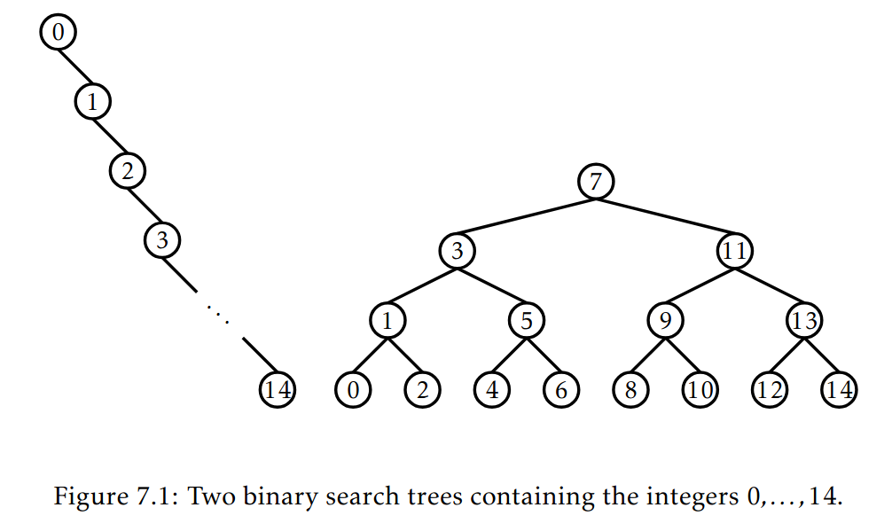
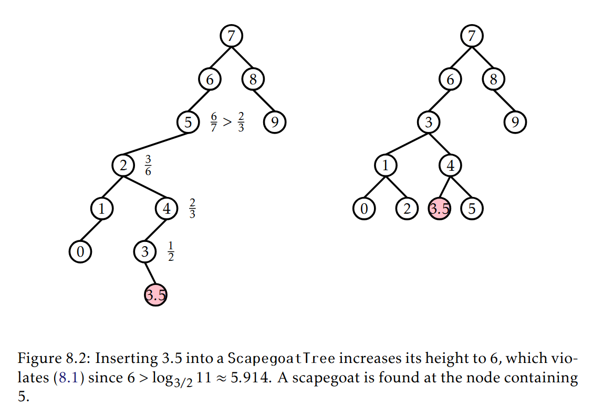
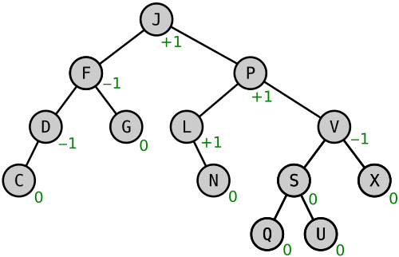
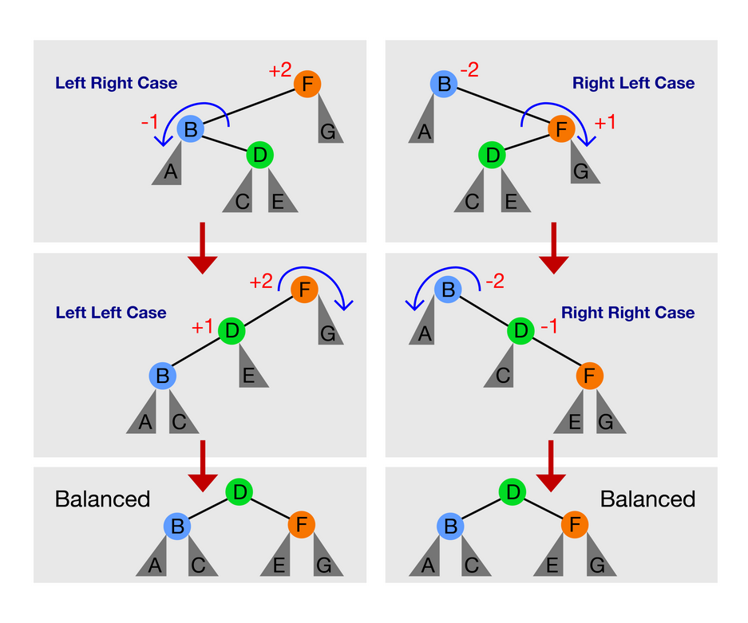
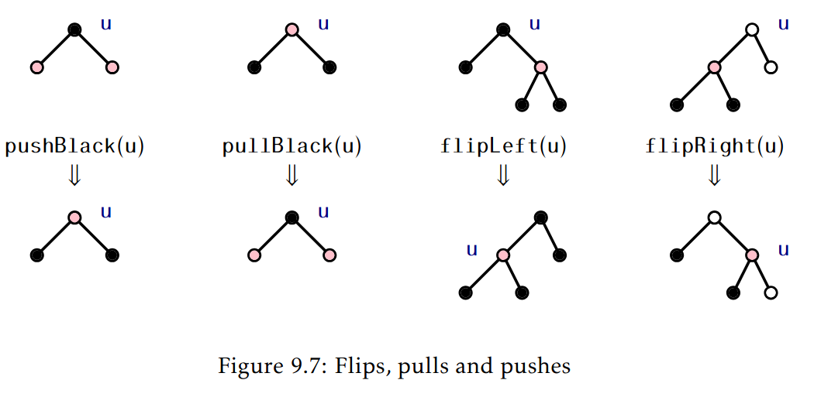
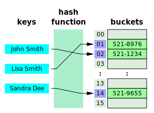
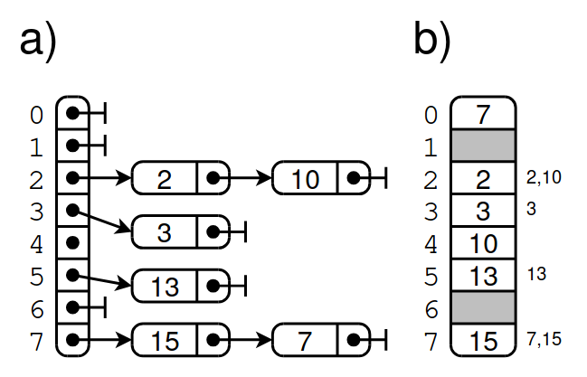

% C5-Associative ADTs
% (manuel.freire@fdi.ucm.es)
% 2026.02.25

## Goal

> Associative ADTs

# Motivation

## Statement

In the previous chapter, we introduced (unbalanced) binary search trees (BSTs). We could use them to implement

* an ordered *Set*, by relying on their ordering
* an ordered *Map*, which is like a *Set* but with keys (sorted) and values (anything) instead of using only keys: the official `TreeMap` is implemented on a BST.

Unbalanced BSTs are ok for maps... if the data balances out. What if it does not? Is there anything better for implementing a *Map* (or *Set*)? In this chapter, we 

* look at ways to balance out binary search trees
* get additional operations on binary search trees that can be really useful
* add a new tool, the **HashMap**, to our inventory. Hash maps do not rely on *ordering* to implement maps, but instead on *scattering* - the **hash** operation.

# BST balancing

## Balancing is critical for performance

{width=90%}

(from [Open Data Structures](https://opendatastructures.org/))

Searching on one of these trees is *great*: $O(log(n))$. \
Searching on the other one... not so great: $O(n)$. 

## How do we balance this?

* *If elements are random, we do not need to balance*. This is very cheap, but also doomed to fail sooner or later. And if bad people are involved, very soon indeed.

... but if you prefer to be safe than sorry, which you should ...

* You can sort a BST in O(n) by rebuilding it completely:

  - put all $n$ elements in a big array $v$
  - create a new BST with root $v_{mid}$, where $mid = {\lfloor n/2 \rfloor}$, and place balanced trees to each side, using this same strategy: 
      - $v_0 \dots v_{mid-1}$ to the left side
      - $v_{mid+1} \dots v_{n-1}$ to the right side.

* However, full rebalancing is slow. If we rebalance after each insert & removal, we would be paying $O(n)$ for each!

## Strategy 1: scapegoat trees

{width=90%} 

(from [Open Data Structures](https://opendatastructures.org/))

Scapegoat trees look for a *scapegoat node* if a threshold is reached. And they just rebalance the tree *at the scapegoat*. This achieves $O(n \cdot log(n))$ amortized insertion/removal cost for $n$ nodes.

## Strategy 2: AVL trees

{width=60%}

(from [Wikipedia](https://en.wikipedia.org/wiki/AVL_tree))

AVL trees perform partial rebalancing after every insert and removal, but only for nodes that are out-of-balance: $\big| depth_{left} - depth_{right} \big| > 1$

- - - 

There are 4 types of rotations that may need to be performed on AVLs:

{width=60%}

 (from [WISC](https://pages.cs.wisc.edu/~qingyi/))

## Strategy 3: Red-black trees

Red-black trees have certain desirable properties, which makes them the implementation used in the C++ and Java standard libraries:

1. A red-black tree storing $n$ values has height at most $2 \cdot log(n)$.
2. The `add(x)` and `remove(x)` operations on a red-black tree run in
$O(log(n))$ worst-case time.
3. The amortized number of rotations performed during an `add(x)` or
`remove(x)` operation is *constant*.

The bad part is that they are really complex to implement. We will not look into them in any detail - see bibliography if you are really interested.

{width=60%}

(from [Open Data Structures](https://opendatastructures.org/))

# Additional BST operations

## Iteration

* BSTs guarantee ordered traversal. Implementing one is not difficult:
* In the official `TreeMap.h`, there is both an `Iterator` (below) and a `ConstIterator` (similar, but const):

~~~{.cpp}
class Iterator {
public:
    Iterator() : _current(nullptr) {}
    void next() { /* ... beware: O(log n) ... */ }     
    const K &key() const { /* ... throws if !_current */ }
    V &value() {  /* ... throws if !_current */ }
    bool operator==(const Iterator &other) const {
        return _current == other._current;
    }
    bool operator!=(const Iterator &other) const { /* ! == */ }
    Iterator &operator++() { /* ... calls next() ... */ }
    Iterator operator++(int) { /* ... calls next() ... */ }

protected:
    friend class TreeMap;

    Node *_current;
    Stack<Node*> _ancestors; // because no current->_parent
};
~~~

## Iteration: next() without a parent pointer

~~~{.cpp}
void next() {
    if (! _current) throw InvalidAccessException();
    if (_current->_right) { // have right: go to smallest child        
        _current = firstInOrder(_current->_right);
    } else {                // backtrack to 1st unvisited ancestor
        if (_ancestors.empty()) { // Reached root!
            _current = nullptr;
        } else {
            _current = _ancestors.top();
            _ancestors.pop();
        }
    }
}
Node *firstInOrder(Node *p) {
    if (!p) return nullptr;
    while (p->_left) {
        _ancestors.push(p); // store to pop/visit later
        p = p->_left;
    }
    return p;
}
~~~

## Finding iterators

You not only have iterators for `begin()` and `end()` - there is also an O(log(n))\footnote{if balanced} `find(K key)`:

~~~{.cpp}
// TreeMap::find
Iterator find(const K &key) {
    Stack<Node*> ancestors;
    Node *p = _root;
    while (p != nullptr && 
          (_cless(p->_key, key) || _cless(key, p->_key))) {
        if (_cless(key, p->_key)) {
            ancestors.push(p);
            p = p->_left;
        } else {
            p = p->_right;
        }
    }
    Iterator ret;
    ret._current = p;
    if (p != nullptr)
        ret._ancestors = ancestors;
    return ret;
}
~~~

## Finding in the neighborhood

Since iteration is ordered, there are many additional things you may want to do. In the c++ `std::map`, you have:

* `lower_bound(const K &k)`: Returns an iterator pointing to the first element that is *not less* than `k` (lowest $k_2 | k_2 \geq k$)
* `upper_bound(const K &k)`: Returns an iterator pointing to the first element that is *greater* than `k` (lowest $k_2 | k_2 > k$)

In Java, you have even more possibilities:

* `NavigableMap<K,V> tailMap(K fromKey, boolean inclusive)`
Returns a view of the portion of this map whose keys are greater than (or equal to, if inclusive is true) fromKey.
* `NavigableMap<K,V> headMap(K toKey, boolean inclusive)`
Returns a view of the portion of this map whose keys are smaller than (or equal to, if inclusive is true) toKey.

# HashMaps

## Goal 

{width=60%} 

(from [Wikipedia](https://en.wikipedia.org/wiki/Hash_table))

Imagine a magic function that allows us to convert any key into well-distributed integers in a range, with no collisions. 

- we could use it to place keys from any key-value set into an array indexed by the magic function ...
- ... and would then have O(1) lookup, insert & remove! Yipee!

## Hash function

Hash functions are magic. They just need to fulfill certain requirements:

* $\forall k, h(k) \in \mathbb{{0, 2^w}}$ - **outputs fixed-size integers** (typically, w=32: 32-bit `usigned int`)
* $k_1 = k_2 	\Rightarrow h(k_1) = h(k_2)$ - **results must be consistent**
* $P(k_1 \neq k_2 \Rightarrow h(k_1) \neq h(k_2)) \approx 1/{2^w}$ - **chance of collision must be low**. A collision is when two distinct keys hash to the same result. Note that, in general, there will be a much larger space of possible keys than possible 32-bit integers (imagine hashing arbitrary-length strings) -- *collisions are unavoidable*, but should be as rare as possible. 

And, additionally, hash functions should be **fast** to compute

## Hashing typical things (see Hash.h)

~~~{.cpp}
// integers are *easy*
inline unsigned int myhash(int key) {
    return (unsigned int)key;
}

// Fowler/Noll/Vo (FNV) -- 
// adapted from http://bretmulvey.com/hash/6.html 
inline unsigned int myhash(std::string key) {
    const unsigned int p = 16777619; // large prime
    unsigned int hash = 2166136261;  // initial value
    for (unsigned int i=0; i<key.size(); i++)
        hash = (hash ^ key[i]) * p; // ^ is a bit-wise xor
    // final mix
    hash += hash << 13;
    hash ^= hash >> 7;
    hash += hash << 3;
    hash ^= hash >> 17;
    hash += hash << 5;
    return hash;
}
~~~

## Bad hashes

~~~{.cpp}
// satisfies all requirements, except low collision rate
inline unsigned int myhash(std::string key) {
    return 42; 
}

// ok-ish, but very high collision rate
// h("abc") == h("cba") == h("cab") and so on
inline unsigned int myhash(std::string key) {
    unsigned int hash = 0;
    for (unsigned int i=0; i<key.size(); i++)
        hash += key[i];
    return hash;
}
~~~

## The two tables: open vs closed

* Open hashing: slower (linked lists!), fixed per-element overhead
  - array of linked lists, with key-value pairs in list nodes
  - use $h(k)$ to assign a linked list to each k
  - grow array when lists are getting long (say over 16 elements in average)
* Closed hashing: faster (arrays!), unused space os wasted, no overhead
  - array of key-value pairs
  - use $h(k)$ to assign index
    + if index is already full with different key, retry either with different hash function ($h_2, \cdot h_n$) or with a skipping strategy (sequential, ...)
  - grow array when load factor (used vs max) is getting high (say over 70%)

- - - 

{width=80%} 

(from [Efficient data structures for sparse network representation](https://doi.org/10.1080/00207160701753629))

a) is open hashing
b) is closed hashing, with a strategy of picking the next free position whenever a collision is found.

## Good vs Bad hashing with an open hash table

* With good hashing,

  - all keys will be evenly distributed among the linked lists
  - so all lists will have a constant size $\approx k$
  - so lookup will be $O(1)$ to hash, + $O(k)$ to iterate the corresponding list, either finding the key or concluding that it is not there: $O(1) + O(constant) \equiv O(1)$

* With bad hashing,

  - some lists will be much larger than others, due to many collisions
  - so their size will be in $O(n)$, instead of constant
  - so lookup in such lists will be $O(1) + O(n) \equiv O(n)$ instead of $O(1)$

# Implementing open hashing

## The private part of HashMap.h

~~~{.cpp}
template <typename K, typename V, typename Hash = std::hash<K>>
class HashMap {
private:
    class Node {
    public:
        Node(const K &key, const V &value, Node *next) :
                _key(key), _value(value), _next(next) {};
        K _key;
        V _value;
        Node *_next;
    };  

    /* ... */

    static const unsigned int MAX_OCCUPATION = 80;
    Node **_bins;
    Hash _hash;
    unsigned int _binCount;
    unsigned int _entryCount;
};    
~~~

## Finding a key

~~~{.cpp}
static void findWithPrevious(const K &key, Node* &current, Node* &prev) {
    prev = nullptr;
    bool found = false;
    while ((current != nullptr) && !found) {
        // check current key against searched-for key 
        if (current->_key == key) {
            found = true;
        } else {
            prev = current;
            current = current->_next;
        }
    }
}

static Node* findNode(const K &key, Node* n) {
    Node *current = n;
    Node *next = nullptr;
    findWithPrevious(key, current, next);
    return current;
}
~~~

## Inserting a key-value pair

~~~{.cpp}
  void insert(const K &key, const V &value) {        
      // If occupation very high, grow table
      float occupation = 100 * ((float) _entryCount) / _binCount;
      if (occupation > MAX_OCCUPATION) {            
          grow();
      }
      // Locate bin index
      unsigned int idx = _hash(key) % _binCount;
      // Look for key in bin
      Node *n = findNode(key, _bins[idx]);
      if (n != nullptr) { // key exists in bin: overwrite value
          n->_value = value;
      } else { // new key: insert new node (via push_first)
          _bins[idx] = new Node(key, value, _bins[idx]);
          _entryCount++;
      }
  }
~~~

## Removing a key

~~~{.cpp}
  void erase(const K &key) {
      // Locate bin index
      unsigned int idx = _hash(key) % _binCount;
      // Find node with key; and if present, also previous node
      Node *n = _bins[idx];
      Node *prev = nullptr;
      findWithPrevious(key, n, prev);
      if (n != nullptr) { // found!
          // remove from list
          if (prev != nullptr) {
              prev->_next = n->_next;
          } else {
              _bins[idx] = n->_next;
          }
          // And now, delete it
          delete n;
          _entryCount--;
      }        
  }
~~~

## Growing up

Remember growing vectors? This is *very* similar.

~~~{.cpp}
void grow() {
    Node **oldBins = _bins;
    unsigned int oldBinCount = _binCount;
    _binCount *= 2;
    _bins = new Node*[_binCount];
    for (unsigned int i=0; i < _binCount; ++i) {
        _bins[i] = nullptr;
    }  
    for (unsigned int i=0; i<oldBinCount; ++i) {
        Node *n = oldBins[i];
        while (n != nullptr) {
            Node *aux = n;
            n = n->_next;
            unsigned int idx = _hash(aux->_key) % _binCount; // new index
            aux->_next = _bins[idx];
            _bins[idx] = aux;
        }
    }
    delete[] oldBins;
}
~~~

## Iterating a HashMap

* There is *no consistent order* in a HashMap
* HashMap iterators are (silently) *invalidated* whenever the map grows

\footnotesize

~~~{.cpp}
class Iterator {
public:
    Iterator() : _table(nullptr), _current(nullptr), _idx(0) {}
    void next() { /* O(1) ! */ }
    const K &key() const { /* throws if no current */ }
    V &value() const { /* throws if no current */ }
    bool operator==(const Iterator &other) const {
        return _current == other._current;
    }
    bool operator!=(const Iterator &other) const {
        return !(this->operator==(other));
    }
    Iterator &operator++() { next(); return *this; }
    Iterator operator++(int) { Iterator ret(*this); next(); return ret; }

protected:
    friend class HashMap;

    const HashMap *_table;  // in case it grows!
    Node* _current;
    unsigned int _idx;      // list where _current is found
};
~~~

\normalsize

## Advancing the iterator

~~~{.cpp}
void next() {
    if (_current == nullptr) {
        // reached end; complain
        throw InvalidAccessException();
    }
    // return next node in current bin
    _current = _current->_next;
    // if bin exhausted, return 1st node in next non-empty bin
    while ((_current == nullptr) 
              && (_idx < _table->_binCount - 1)) {
        ++_idx;
        _current = _table->_bins[_idx];
    }
}
~~~

## The end and the beginning

~~~{.cpp}
Iterator begin() const {
    unsigned int idx = 0;
    Node *n = _bins[0];
    while (idx < _binCount - 1 && n == nullptr) {
        idx++;
        n = _bins[idx];
    }
    return Iterator(this, n, idx);
}

/** 
  * Returns a non-constant map iterator just outside the map, reachable by an iterator 
  * that starts at begin()
  * O(1) 
  */
Iterator end() const {
    return Iterator(this, nullptr, 0);
}
~~~

# The `[]` operator in maps

## Goal

~~~{.cpp}
void add(const string& word) {
  counts[word]++; // O(1) lookup & insert !!
}
~~~

* If `counts.contains(word)`, then its counter is incremented
* Otherwise, it is assigned (default) value 0, which is then incremented to 1. 

~~~{.cpp}
void add(const string& word) {
  if (counts.contains(word)) {    
    counts.insert(word, counts.at(word) + 1);
  } else {
    counts.insert(word, 1);
  }
}
~~~

Equivalent, but does 3 lookups in the worst case (contains, at, insert) - instead of a signle lookup if using `[]`. Same asymptotic performance, but 3x slower: **prefer `[]`**

## `[]` in the official HashMap

~~~{.cpp}
// in HashMap.cpp 
V &operator {
    // Locate bin index
    unsigned int idx = _hash(key) % _binCount;
    // Look for key in bin
    Node *n = findNode(key, _bins[idx]);
    if (n == nullptr) { // Not there, must add default V
        insert(key, V());
        // beware: idx may have changed due to growth!
        idx = _hash(key) % _binCount;
        n = findNode(key, _bins[idx]);
    }        
    return n->_value;
}
~~~

## `[]` in the official TreeMap

~~~{.cpp}
// in HashMap.cpp 
V &operator {
    bool inserted;
    Node* ret = findOrInsert(_root, key, inserted); 
    if (inserted) { 
        ++_size;
    }
    return ret->_value;
}
~~~

- - - 

~~~{.cpp}
Node *findOrInsert(Node* &root, const K &key, bool& inserted) {
    if (root == nullptr) { // Key not present: return new Node*
        inserted = true;
        root = new Node(key, V()); // adds new node to tree
        return root; 
    } else if (_cless(key, root->_key)) { // key < root->_key
        return findOrInsert(root->_left, key, inserted);
    } else if (_cless(root->_key, key)) { // key < root->_key
        return findOrInsert(root->_right, key, inserted);
    } else {              // Key found: do not modify it
        inserted = false;
        return root;      
    }
}
~~~

## `[]` and const maps

* `[]` is non-const in both TreeMap and HashMap. 
* Adding a const `[]` would have been possible, but would have had to throw exceptions if the key was not found (it would be identical to `at`)
* If your map is `const`, you are out of luck, and must rely on `.at`

# TLDR;

## Maps in the real world

* Maps (also called Dictionaries and Associative Containers) are one of the most frequently-used ADTs (right up there with vectors)
* *Nobody* does linear lookup (except for very short sequences). Even messing with binary search is rare. *Everybody uses maps!*
* Databases are special. Special types of trees are used there - in particular, B-trees (self-balancing n-ary sorted trees) are great for indexes & implementing filesystems, because their arity can be adjusted to fit exactly where they should.

~~~{.js}
// JSON is just arrays & maps!
const json_example = {
  first_name: "Frodo", 
  family_name: "Baggins",
  friends: ["Bilbo", "Sam", "Pippin", "Merry"]
}
~~~

## Java vs C++

Java has a nice naming scheme. Normally, you work with as abstract an interface as possible (if no sorting needed, declare `Map` instead of `HashMap`)

~~~{.java}
Map<String,Integer> m; // an interface
m = new HashMap<>();   // (un-sorted) hash map
m = new TreeMap<>();   // (sorted) tree map
m.add("foo", 1);
// java equivalent to C++ operator[] on maps
m.compute("bar", (k,v) -> (v==null) ? 1 : v+1);
~~~

Java will throw exceptions on invalid iterator use (because Map iterators also use change-versioning to detect if collections are mutated while being iterated). 

- - -

In C++, you normally declare exactly what you want. Overloaded `[]` operators are easier than the Java equivalent.

~~~{.cpp}
map<string,int> m; // a tree map on a red-black BST
m["foo"] = 1;
m["bar"] ++; 
unordered_map<string,int> m2; // a hash map
m2["foo"] = 1;
m2["bar"] ++;
~~~

C++ will *not* throw any exceptions on invalid iterator use, but may explode (or not), since such use is still UB.

## Contains in C++

Until C++ 20, C++ maps did not support the `contains` operation:

~~~{.cpp}
m.contains("foo");        // will probably not compile
m.find("foo") == m.end(); // equivalent, compiles fine since forever
m.count("foo");           // equivalent (1 is != 0 and therefore "true")
~~~

# Questions? Comments?

## Exercises

1. Given a list of employees indicating the ones that have sold a car in each day, provide a sorted list of the employees with the number of cars sold in the total amount of days.
	
2. Extend the official TreeMap with an `erase` operation:
	
~~~{.cpp}
// receives an iterator and erases the pair (key,value)
//    returning an iterator to the next item
Iterator erase(const Iterator &it);
~~~

3. Implement a TreeMap operation to fully *balance* the tree. Use an external data-structure to help you out. 
	
4. TreeMaps and HashMaps are two types of associative containers that allow you to store (key, value) pairs indexed by key. Discuss their similarities and differences: what requirements does each one impose on the type used as a key, when is it more convenient to use each?
	
- - - 

5. Add the following operations to the official TreeMap and
	analyze their complexity:
	
    * **query(int k)**: receivesreturns the k-th key of the search tree, in tree iteration order.
      
    * **goThroughRange(K a, K b)**: given two keys, $a$ and $b$, returns
      a list of the values associated with the keys that are in the
      interval $[a..b]$, in tree itertion order.
	

6. What changes would you make in the implementation of the
TreeMap to allow multiple values for the same key? (This is known as a *multimap*). This implies:

    * When querying a key, the result will be a *list* of values associated with that key, in the order in which they were inserted.
    * When inserting a (key, value) pair, the value will always be stored for later retrieval (in TreeMap.h, previous values would be overwritten instead)
    * Deleting a key must remove *all* values associated with that key.
	
7. In the motivation section the input was a single text. Let the input be *several* texts instead, that is, a `List<List<string>>`. Write a program that, given several texts, generates a TreeMap where, for each word (key), there is a list of the texts where it appears. For example, if the word `potato` appears in texts 3, 6 and twice in 7, the output of `outputMap['potato']` would be a List with `3, 6, 7, 7`.

- - -

8. Implement a *Set* ADT based on hash tables with the usual operations: *emptySet*, *insert*, *delete*, *contains*, and also *union*, *intersection* and *difference*, which perform set operations with a different *Set*, passed in as a const reference. 
	
9. Propose a suitable hash function for your {Set} ADT, so that it is possible to use sets as keys to a table.
	
10. The *radial index* of an open table is defined as the length of the vector times the number of elements in the longest collision list. Extend the official HashMap ADT with a method that returns its radial index. 
	
11. Vectors implemented by means of Hash tables are called *sparse*. This technique is recommended when the total set of possible indices is very large, and the vast majority of them have a default value, such as 0. For instance, we could use a `HashMap<int,float>` to provide a `vector<float>`-like ADT which only really stores positions with a non-0 value. Implement this ADT, with functions for adding and multiplying by a scalar.

- - -

12. Use a HashMap, and then a TreeMap, to solve the motivation problem of the previous chapter. 

13. Given all the ED exercises that the students have delivered, and the total number of lab sessions, where exercises are either incorrect (and then do not contribute to grades) or correct (and they then contribute according to $grade/total\_exercises$), build a list the names of	all students in alphabetical order and their total exercise score, by implementing

~~~{.cpp}
struct Exercise {
  string student_name;
  bool is_correct;
  float grade; /* 0-10 */
};
TreeMap<string,float> grade(int total_exercises, 
    const List<Exercise> &exercises);
~~~

14. Implement a safe iterator for the official HashMap, so that if the HashMap grows after the iterator was created, attempting to use the iterator will throw an exception (instead of accessing potentially free'd memory)

## The End

{ width=25% }

This work is licensed under a [Creative Commons Attribution-ShareAlike 4.0 International License](https://creativecommons.org/licenses/by-sa/4.0/)

- Initial version by Manuel Freire (2012-13)
- Initial English version by Gonzalo Méndez (around 2017?)
- Changes for academic years 2022-26 by Manuel Freire
